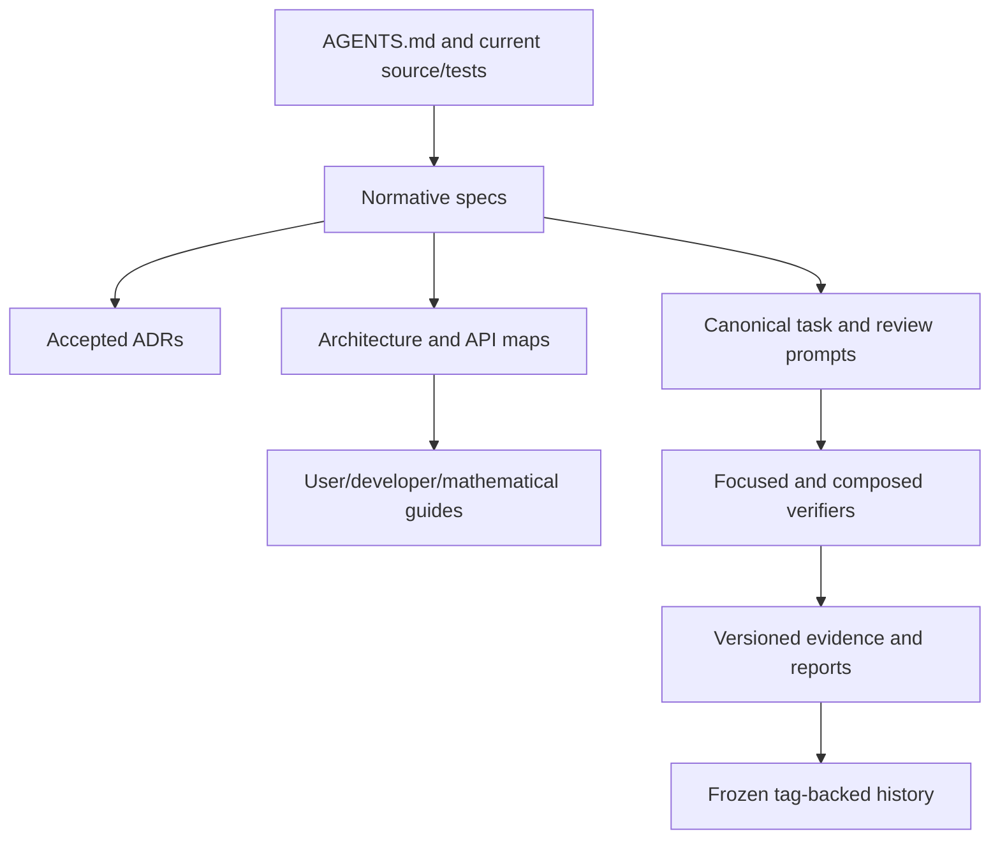

# GeoCeDG documentation architecture

- Status: current-state map under the **NORMATIVE / AUTHOR APPROVED** G9 maintenance contract
- Date: 2026-08-16
- Normative maintenance contract: `geocedg/specs/operations/documentation-maintenance.md`

## Purpose

GeoCeDG documentation is a linked set of authorities rather than a single
manual. The repository contract and accepted specifications govern behavior;
guides explain that behavior for different audiences; validation reports retain
evidence for named revisions.



Arrows mean traceability, not duplication. Source, tests and serialization
contracts remain above prose when they disagree.

## Audience entry points

- Users start with `docs/user/geocedg_user_guide.md` and follow the linked
  mathematical reference for deeper derivations.
- Developers start with `docs/developer/geocedg_developer_guide.md`, then the
  repository map and relevant API guide.
- Agents start with `AGENTS.md` and
  `docs/developer/geocedg_agent_prompt_guide.md`, then the canonical prompt.
- Reviewers use the capability traceability matrix and phase evidence.

## Current capability boundary

G6-G8 provide productive internal Locus V2 semantic, metric and intersection
classes. They do not provide public commands, normal toolbar workflows, `Path`,
copy/XML persistence or saved-file support. G5 DXF is observable and remains an
experimental exact 2D export. G9 artifacts produced during planning are
proposals and do not establish product behavior.

## G9P audit disposition

| Finding | Disposition |
|---|---|
| main guide mixed pre-closeout G8C2/G8 statements with global G8 PASS | corrected as living current-state prose; historical reports remain unchanged |
| G7/G8 metric documents still described their successor phase as not started | qualified as historical scope or updated to the current internal capability boundary |
| scientific catalog references named a nonexistent `cedg-scientific-catalog.yml` | corrected to the repository source `docs/references/cedg/catalog.yml` |
| detailed mathematics was embedded across user/API/architecture material | added one explanatory mathematical entry point; normative formulae remain in specs |
| no complete project developer or agent-prompt guide existed | added audience-specific guides without duplicating semantic contracts |
| G6-G8 internal classes could be mistaken for public workflows | user/developer entry points now repeat the missing command/`Path`/persistence boundary |

Historical validation reports intentionally overlap living documentation: they
record what a phase established. That overlap is not removed or synchronized
by rewriting evidence. Remaining future documentation work belongs to its
separately authorized implementation phase.

## Living versus historical documents

Living guides report current `HEAD`. Historical reports and machine-readable
hash manifests report a named revision. The fixed G8 historical anchor is the
annotated `geocedg-g8-pass` tag object
`fed1bfbeea77a48acce285429b397eda77054df1`, peeled to
`e7810171179825a03b22d8c6eba28c672f468281`.

Old verifiers must read historical manifests and their targets from the tag
tree. Current documentation is validated separately, so correcting a stale
guide never requires rewriting a historical manifest.

## Mathematics

Normative formulae, tolerances, statuses and degeneracies live in feature specs.
`docs/user/geocedg_mathematical_reference.md` is explanatory and records when
spatial material is merely proposed. Architecture documents map concepts to
source; they do not redefine the mathematics.

## Maintenance flow

```text
capability change
  -> source/spec/ADR authority
  -> GUIDE_IMPACT decision
  -> affected audience documents
  -> traceability matrix
  -> scoped link/schema/status checks
  -> focused verifier and evidence
```

Generated knowledge bundles, if later authorized, consume this topology. They
do not flatten or replace it.
