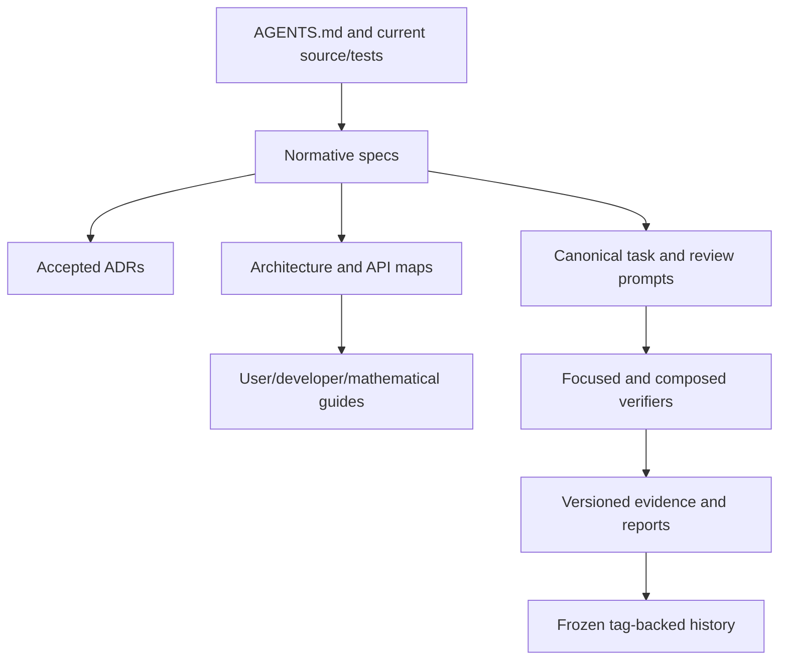

# GeoCeDG documentation architecture

- Status: current-state map under the **NORMATIVE / AUTHOR APPROVED** G9 maintenance contract
- Date: 2026-08-21
- Normative maintenance contract: `geocedg/specs/operations/documentation-maintenance.md`

## Purpose

GeoCeDG documentation is a linked set of authorities rather than a single
manual. The repository contract and accepted specifications govern behavior;
guides explain that behavior for different audiences; validation reports retain
evidence for named revisions.



Arrows mean traceability, not duplication. Source, tests and serialization
contracts remain above prose when they disagree.

## Audience entry points

- Users start with `docs/user/geocedg_user_guide.md` and follow the linked
  mathematical reference for deeper derivations.
- Developers start with `docs/developer/geocedg_developer_guide.md`, then the
  repository map and relevant API guide.
- Agents start with `AGENTS.md` and
  `docs/developer/geocedg_agent_prompt_guide.md`, then the canonical prompt.
- Reviewers use the capability traceability matrix and phase evidence.

## Current capability boundary

G6-G8 provide the internal Locus V2 semantic, metric and intersection
foundation. G9U0 and G9U0-R1 provide an author-approved experimental,
default-off public surface with durable copy/XML/save support; Locus V2 remains
non-`Path`. G9X1 provides the author-approved experimental/default-off extended
DXF adapter. G9U0-R2 now provides the author-approved ordinary Locus V2
presentation/continuity refinement and `.cedg` native-document identity. The
internal ZIP/XML machinery and `app_code: classic` remain unchanged; `.ggb` is
the non-destructive compatibility-input boundary.

G9U0-R2 planning/design and implementation are **PASS — AUTHOR APPROVED**. The
original R2-L11 smoke failure remains historical evidence; the bounded
full-period render correction, automated authority and interactive author
re-smoke all pass. The user guide now records the promoted `.cedg` lifecycle and
ordinary Locus presentation behavior while retaining the experimental/default-
off Locus V2 boundary and the unsupported external-upstream boundary.

## G9P audit disposition

| Finding | Disposition |
|---|---|
| main guide mixed pre-closeout G8C2/G8 statements with global G8 PASS | corrected as living current-state prose; historical reports remain unchanged |
| G7/G8 metric documents still described their successor phase as not started | qualified as historical scope or updated to the current internal capability boundary |
| scientific catalog references named a nonexistent `cedg-scientific-catalog.yml` | corrected to the repository source `docs/references/cedg/catalog.yml` |
| detailed mathematics was embedded across user/API/architecture material | added one explanatory mathematical entry point; normative formulae remain in specs |
| no complete project developer or agent-prompt guide existed | added audience-specific guides without duplicating semantic contracts |
| G6-G8 internal classes could be mistaken for public workflows | user/developer entry points now repeat the missing command/`Path`/persistence boundary |

Historical validation reports intentionally overlap living documentation: they
record what a phase established. That overlap is not removed or synchronized
by rewriting evidence. G9O1 applies this rule by checking the accepted G9P
closeout from its annotated tag while validating current living guides
separately.

## Living versus historical documents

Living guides report current `HEAD`. Historical reports and machine-readable
hash manifests report a named revision. The fixed G8 historical anchor is the
annotated `geocedg-g8-pass` tag object
`fed1bfbeea77a48acce285429b397eda77054df1`, peeled to
`e7810171179825a03b22d8c6eba28c672f468281`.

Old verifiers must read historical manifests and their targets from the tag
tree. Current documentation is validated separately, so correcting a stale
guide never requires rewriting a historical manifest.

The accepted G9P design is likewise frozen at annotated tag
`geocedg-g9p-pass`, tag object
`6ce37f03df6f742aa448323d2150dd1655c986a5`, peeled commit
`94f92f49a44560e44bae9e75ba52595067471368`. G9O1 does not rewrite the G9P
integrity manifest when living operations documents advance.

## Mathematics

Normative formulae, tolerances, statuses and degeneracies live in feature specs.
`docs/user/geocedg_mathematical_reference.md` is explanatory and records when
spatial material is merely proposed. Architecture documents map concepts to
source; they do not redefine the mathematics.

## Maintenance flow

```text
capability change
  -> source/spec/ADR authority
  -> GUIDE_IMPACT decision
  -> affected audience documents
  -> traceability matrix
  -> scoped link/schema/status checks
  -> focused verifier and evidence
```

Generated knowledge bundles consume this topology through explicit profiles.
They preserve file boundaries, provenance and reading order; they do not
flatten or replace repository authority.

## G9U0-R2 approved documentation-impact design

Planning authority belongs in the living roadmap,
`docs/architecture/g9u0_r2_product_refinement_design.md`, Accepted ADR 0016 and
the two normative specifications. Historical G9U0/G9U0-R1/G9X1 reports and the
frozen G9P prompt catalog are not rewritten.

The living user guide had to retain `.ggb` Save/reopen and package association
until R2 was author-approved and promoted. The approved R2 closeout completes
the mandatory `GUIDE_IMPACT` transition:

- user guide: native Save/Save As, omitted suffix, `.ggb` compatibility input,
  reopen/recent/direct-open, Classic diagnostic behavior, corrupt-file failure,
  `.cedg` Windows association and Locus Properties/style continuity;
- developer guide: extension routing seams, unchanged ZIP/XML and
  `app_code: classic`, source classification, no semantic filename inference,
  render-subpath invariants, focused/composed verifier and upstream-impact
  inventory; and
- packaging/release guide: installer-only `.cedg` association, portable
  non-association and the unchanged redistribution block.

Those guide edits describe author-approved behavior after fast-forward
promotion. They do not claim an installed MSI/registry smoke, public
redistribution approval, or authorization of G9U1.
