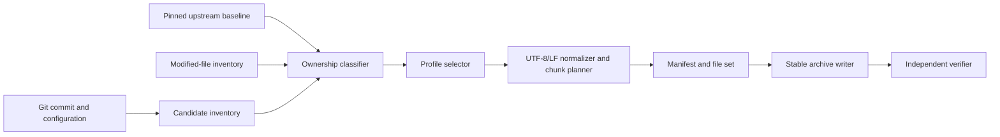

# Deterministic knowledge bundle architecture

- Status: author-approved architecture under a **NORMATIVE / AUTHOR APPROVED** contract
- Phase: G9O1 — **AUTHORIZED / NOT STARTED**
- Productive generator: absent
- Contract: `geocedg/specs/operations/knowledge-bundles.md`
- Accepted ADR: `docs/adr/0015-deterministic-source-knowledge-bundle-ownership.md`

## Component design

All components are future operational services outside the kernel. G9P defines
their contracts only.

## Ownership engine

Classification first applies explicit restricted/generated exclusions, then
native ownership, then modified-upstream evidence, and finally explicitly
allowed unchanged upstream reference. The engine records every evidence source
used. Conflicting classification fails closed.

The baseline comparison is blob-based at the pinned GeoGebra commit. A modified
upstream entry retains the complete current file, baseline blob SHA, change
summary and optional derived unified diff.

## Selection and ordering

Profiles are declarative input. Selection results are sorted by normalized
repository-relative path and then by declared reading-order rank. A profile may
add related tests/specs but may not override restricted/generated exclusions
without a separately recorded explicit authorization.

## Content pipeline

Text is read as bytes, decoded as strict UTF-8, stripped of an optional UTF-8
BOM and normalized to LF. Hashes cover canonical bytes. Binary files require an
explicit profile and are copied byte-for-byte. No timestamp, local absolute path
or host-specific path separator enters deterministic content.

Chunk planning respects complete files and semantic boundaries. A continuation
contains the complete source hash and exact range, so chunks cannot be mistaken
for independent source.

## Manifest and archive

The manifest is written before the archive, then independently re-read. The
bundle ID is derived from schema version, commit and canonical configuration.
Archive entries use stable path order, permissions and timestamp metadata. A
dirty bundle includes a canonical diff hash and is visibly non-release evidence.

## Verification

The future verifier independently recomputes:

- fixed commit/freshness and clean/dirty policy;
- ownership from baseline/inventory/history;
- exclusions and license/provenance;
- canonical file and configuration hashes;
- bundle ID, order, chunks and budgets;
- stable archive metadata and byte reproducibility.

It must not trust generator summaries. No productive generator or verifier is
authorized by this architecture.
