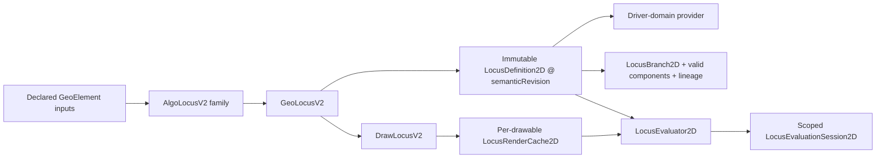

# Locus V2 implementation architecture

| Field | Value |
|---|---|
| Status | G6R closeout architecture; Locus V2 remains experimental/internal |
| Semantic authority | [`locus-v2-semantics.md`](../../geocedg/specs/locus/locus-v2-semantics.md) |
| Decision | [ADR 0006 Accepted](../adr/0006-parallel-locus-v2-semantic-entity.md) |
| Implementation baseline | `0c4cc40a389477226b2a6cb507c4fa072790a586` |
| Hardening entry | `e78b4e71ebf752de8c3552b466dbee52b400ab94` |
| Date | 2026-08-12 |
| Current additive metric layer | [G7B metric architecture](locus_v2_metric_architecture.md), `PASS — AUTHOR APPROVED` |

This document describes the implementation that exists after G6R. It does not
extend the normative semantics and does not make Locus V2 public. The
[developer API reference](../developer/locus_v2_api.md) gives method-level
contracts; the [user guide](../user/geocedg_user_guide.md) is the operational
entry point.

Sections 1–11 intentionally preserve the G6R baseline. G7B subsequently added
the separate internal metric layer documented by the
[metric implementation architecture](locus_v2_metric_architecture.md) and
[metric developer API](../developer/locus_v2_metric_api.md); it did not change
the legacy metric or public-command boundaries recorded here.

## 1. Implemented boundary



The normal kernel DAG remains the sole dependency authority. Algorithms capture
immutable source/provider data during normal recompute and publish a semantic
snapshot. Point evaluation reads that snapshot; it does not mutate the live
construction, build a dependency slice, trigger render or publish a revision.

Nested composition is recursive semantic composition:

```text
evaluate L3(t)
  -> evaluate L2(phi(t), same scoped session)
       -> evaluate L1(psi(phi(t)), same scoped session)
```

No level consumes legacy samples, render vertices or a whole upstream locus.

## 2. Class and API audit

All `org.geocedg` classes are GeoCeDG-owned even though they are compiled in the
upstream module layout. “Public” below means Java visibility required across
shared packages; it is not a supported end-user or third-party API.

| Class/API | Responsibility | Visibility | Mutability | Ownership | Thread confinement | Principal invariant | Tests / limitation |
|---|---|---|---|---|---|---|---|
| `GeoLocusV2` | Parallel experimental kernel object and current definition reference | `public final` | Normal-algorithm publication plus explicit undefined flag | GeoCeDG | Existing kernel thread | Distinct `GeoClass.LOCUS_V2`; not legacy `Path`, XML or 3D | Kernel/lifecycle; copy/set/undo persistence unsupported |
| `AlgoLocusV2` | Normal-DAG input/output and revision publication | abstract base | Construction-managed | GeoCeDG | Kernel thread | Equivalent recompute creates no revision | Lifecycle/invalidation |
| `AlgoAnalyticLocusV2` | Explicit-numeric live algorithm | `public final`, factory only | Captured source per recompute | GeoCeDG | Kernel thread | Finite normalized snapshot | Numeric/lifecycle |
| `AlgoSegmentPathLocusV2` | Approved live segment pilot | `public final`, factory only | Captured endpoints per recompute | GeoCeDG | Kernel thread | Provider parameter, never `PathParameter` identity | Provider/integration/laboratory |
| `AlgoDynamicBranchLocusV2` | Dynamic branch/component snapshots | `public final`, factory only | Snapshot replaced on recompute | GeoCeDG | Kernel thread | Keys independent of coordinates/sample order | Topology/lifecycle |
| `AlgoNestedLocusV2` | V2-on-V2 dependency | `public final`, factory only | Upstream revision captured on recompute | GeoCeDG | Kernel thread | Recursive semantic call with shared session and normal DAG edge | Depth 1/2/3/5 |
| `LocusDefinition2D` | Complete semantic snapshot and evaluation dispatch | `public final` | Immutable except referenced diagnostic counters | GeoCeDG | Kernel thread | Identity/revision/provider/branches/evaluator coherent | Value/session/evaluator |
| `LocusBranch2D` | Semantic branch descriptor | `public final` | Immutable defensive collections | GeoCeDG | Kernel thread | Branch is not a valid-domain component | Value/topology |
| `LocusBranchSnapshot2D` | Candidate definition status plus branch set | `public final` | Immutable defensive collection | GeoCeDG | Kernel thread | Status and branches have valid shape | Dynamic topology/value |
| `LocusBranchSnapshotFunction2D` | Typed branch-snapshot callback | public functional interface | Implementor-defined; invoked read-only | GeoCeDG | Kernel thread | Runs only during normal recompute | Dynamic topology; internal only |
| `LocusDriverDomainProvider2D` | Versioned provider-owned semantic parameter contract | public interface | Implementations immutable in G6R | GeoCeDG | Kernel thread | Canonicalization/domain are viewport-independent | Provider contracts |
| `ExplicitNumericDomainProvider2D` | `explicit-numeric-domain/v1` | `public final` | Immutable | GeoCeDG | Kernel thread | Finite domain and explicit endpoint/seam policy | Provider/value |
| `StablePathDomainProvider2D` | Approved segment/circle/ellipse mappings | `public final` | Immutable | GeoCeDG | Kernel thread | Segment `[0,1]`; periodic `[-pi,pi)`; no public normalized-path identity | All mappings tested; only segment live |
| `LocusInterval2D` / `LocusPoint2D` | Finite interval/point values | `public final` | Immutable | GeoCeDG | Thread-compatible values, used on kernel thread | Reject non-finite; normalize signed zero | Value hardening |
| `LocusLineage2D` | Typed topology transition | `public final` | Immutable defensive unique lists | GeoCeDG | Kernel thread | Transition-specific parent/child cardinality | Value/topology |
| `LocusQuality2D` / `LocusSemanticMetadata2D` enums | Separate status, regularity, fidelity, method, role and guarantee axes | value/enums | Immutable | GeoCeDG | Kernel thread | No general-status collapse | Value contracts |
| `LocusEvaluation2D` | Valid point or typed evaluation failure | `public final` | Immutable | GeoCeDG | Kernel thread | Point and status cannot contradict | Evaluator/session |
| `LocusEvaluator2D` | Semantic evaluator contract | public functional interface | Implementor-defined; snapshot callback | GeoCeDG | Kernel thread | No render/live-construction mutation | Evaluator/nested |
| `LocusPointFunction2D`, `LocusDynamicPointFunction2D`, `LocusPathPointFunction2D` | Typed point-evaluation callbacks | public functional interfaces | Implementor-defined; read-only inputs | GeoCeDG | Kernel thread | Return finite semantic point or explicit failure | Analytic/dynamic/path tests |
| `LocusParameterMap2D` / `LocusPointTransform2D` | Nested parameter mapping and point transform | public functional interfaces | Implementor-defined; read-only inputs | GeoCeDG | Kernel thread | Composition remains semantic | Nested gates |
| `LocusSourceSnapshot2D` | Immutable numeric source vector | `public final` | Defensive immutable copy | GeoCeDG | Kernel thread | Finite values and normalized signed zero | Value/lifecycle |
| `LocusSemanticKey2D` | Exact session address | `public final` | Immutable | GeoCeDG | Session-local | Identity + revision + branch + canonical finite parameter | Key/session tests |
| `LocusEvaluationSession2D` | Bounded memoization, revision coherence and active-key guard | `public final`, `AutoCloseable` | Scoped cache/counters only | GeoCeDG | Kernel-thread-confined | Deterministic FIFO, full key, `finally` cleanup, disposable | Session/cycle/exception |
| `LocusSessionDiagnostic2D` | Typed session failure evidence | `public final` | Immutable defensive path | GeoCeDG | Kernel thread | Cycle/revision/closed states remain distinct | Session tests |
| `LocusInstrumentation2D` / `LocusInstrumentationSnapshot2D` | Functional counters / coherent observation | mutable owner / immutable value | Counters mutable; snapshot immutable | GeoCeDG | Kernel thread | Diagnostic only, never semantic state | Benchmark/session |
| `LocusDualRunDiagnostic2D` | Typed V1/V2 diagnostic comparison payload | `public final` | Immutable | GeoCeDG | Kernel thread | Does not redirect public `Locus` | Compatibility tests; diagnostic only |
| `LocusValidationTolerance2D` | Approved non-certified comparison envelope | `public final` | Stateless | GeoCeDG | Thread-compatible | Scale excludes origin distance and all view state | Tolerance tests; not G7/G8/render tolerance |
| `LocusV2Mode` | Diagnostic `LEGACY`/`V2`/`DUAL` choice | enum | Immutable | GeoCeDG | Call-site local | Public command remains legacy | Factory/compatibility |
| `LocusV2Factory` | Typed internal creation seam | `public final` for cross-module internal use | Stateless | GeoCeDG | Kernel thread | Rejects `LEGACY`; registers no command | Integration/laboratory |
| `DrawLocusV2` | Dedicated 2D drawable | `public final` | View-owned | GeoCeDG | Existing render thread | Reads evaluator only | Render separation |
| `LocusRenderData2D` | Derived vertices/subpath markers | `public final` | Immutable defensive values | GeoCeDG | View-owned | Carries render provenance, not semantic path data | Render tests |
| `LocusRenderPolicy2D` | Uniform reference/adaptive visual policy | `public final` | Immutable | GeoCeDG | View-owned | Pixel tolerance is presentation-only | Render hardening |
| `LocusRenderCache2D` | Bounded per-drawable tessellation cache/counters | `public final` | At most four entries | GeoCeDG | One drawable/view owner | Revision+view key; never semantic API | Cold/warm/eviction |
| Desktop laboratory classes | Separate launcher/frame, fixtures and diagnostics | package internal except launcher/frame | One disposable process | GeoCeDG | Swing EDT + normal kernel thread | Opt-in, temporary prefs, no persistence/public command | Desktop contract + visual smoke |

## 3. Value contracts and identity

- `LocusPoint2D`, `LocusInterval2D`, source snapshots, providers, branches,
  branch snapshots, lineage, quality and semantic keys use value equality where
  value semantics exist.
- Collection constructors copy, null-check and expose unmodifiable views.
- Coordinates, semantic-key parameters, provider epsilon and numeric source
  snapshots reject NaN/infinity. `+0.0` and `-0.0` are canonicalized to the
  same stored value.
- A semantic key is `(locus identity, semantic revision, branchKey,
  provider-canonical semantic parameter)`. Coordinates, labels, proximity,
  visual order and sample order never participate.
- Periodic seam equivalence belongs to the provider. Endpoint equality and
  branch equality do not rely on pixel tolerances.
- Diagnostics and instrumentation snapshots are values/evidence, not part of
  geometric identity.

## 4. Revision and lifecycle

`AlgoLocusV2.compute()` creates a candidate definition. If semantic content is
equal to the current snapshot, no revision is published. If an object was
explicitly undefined, the equivalent normal-DAG recompute restores its defined
state without inventing a revision. A changed source, provider, branch topology,
valid components, quality or evaluator signature publishes exactly one new
local monotonic revision.

For `L1 -> L2 -> L3`, upstream invalidation is propagated by ordinary
`AlgoElement` inputs. Each changed downstream semantic snapshot gets its own
revision; point queries and zoom/render do not. Old scoped sessions reject a
mixed revision for the same locus identity. Closing or clearing a session
releases cached values and revision observations.

G6R deliberately disables incomplete lifecycle operations:

- `copy()`, `copyInternal()` and `set()` throw a typed unsupported operation;
- list/sequence deep-copy seams therefore fail rather than create a partial
  semantic clone;
- the object emits no XML, so undo/redo persistence and `.ggb` round-trip do not
  exist;
- removing an inner input removes the dependent algorithm chain through the
  normal construction lifecycle;
- labels and selection are diagnostic only; Algebra editing remains disabled.

## 5. Session, cache and cycles

The scoped evaluation session has bounded insertion-order eviction. It is not a
global cache and never owns dependency edges. Active-key bookkeeping is removed
in `finally`, including evaluator exceptions. Typed diagnostics distinguish
cycle re-entry, mixed revisions and a disposed session. Cache-enabled and
reference execution are semantically equal.

G6R measurements did not justify a new eviction policy: memoization eliminates
exact duplicates but adds overhead to unique-query runs. No DAG flattening,
concurrency, pooling or retained cross-revision cache was introduced.

## 6. Rendering and measured optimization

G6 used bounded uniform parameter sampling. G6R retains that strategy as
`UNIFORM_REFERENCE` and adopts `ADAPTIVE_VISUAL` as the normal view policy.
Adaptive subdivision compares the semantic midpoint with the screen-space
chord and uses a 0.75-pixel default visual tolerance with bounded depth 12.

In the controlled analytic-line fixture at 200 pixels/world-unit:

| Policy | Vertices | Cold semantic evaluations |
|---|---:|---:|
| Uniform reference, 256 intervals | 257 | 257 |
| Adaptive visual | 5 | 9 |

The adaptive policy was accepted because it reduced both work and vertices
while semantic evaluation, revision and domain stayed identical. Components
remain separate; periodic seams use provider canonicalization; unbounded
branches are inset/clipped only for presentation. If adaptive evaluation meets
an invalid interior state it falls back to the bounded uniform reference path,
which preserves explicit subpath breaks.

The 0.75-pixel value is not geometric error, numeric guarantee, length error,
intersection residual or export tolerance.

## 7. Provider coverage

| Family | Semantic contract | Provider implemented/tested | Live DAG algorithm | Drawable | Public access |
|---|---|---|---|---|---|
| Explicit finite numeric domain | Yes | Yes / yes | Yes | Yes | No; factory/laboratory only |
| Stable segment mapping | Yes | Yes / yes | Yes | Yes | No; factory/laboratory only |
| Stable circle mapping | Yes | Yes / yes | No | Provider-driven test render only | No |
| Stable ellipse mapping | Yes | Yes / yes | No | Provider-driven test render only | No |
| General function/infinite native domain | Semantic need characterized | No general provider | No | Finite declared laboratory fixture only | No |
| Canonical continuation | Category defined | No productive provider | No | No | No |

Circle/ellipse live algorithms were not added: the existing provider tests prove
the authorized mapping, while a new live driver integration was unnecessary for
hardening and would enlarge the product boundary without a G6R need.

## 8. GeoClass and compatibility dispatch

| Area | G6R disposition |
|---|---|
| `GeoClass` | Supported: `LOCUS_V2` remains append-only; legacy ordinals unchanged |
| 2D drawable | Supported only through `EuclidianDraw -> DrawLocusV2` |
| labels/selection/generic line defaults | Supported as developer diagnostics |
| 3D and plane views | Explicitly unsupported; no dispatch |
| legacy `Path`, incidence, `isGeoLocus*` | Explicitly unsupported/false |
| `CmdLocus`, `AlgoDispatcher`, ODE | Explicitly excluded |
| `Length`, `Perimeter`, legacy metrics | Explicitly excluded at G6R closeout; G7B later adds only a separate internal V2 metric layer |
| XML/factory/migration/undo persistence | Explicitly excluded |
| G5 export | Explicitly rejected as unsupported geometry |

Classic and public `Locus[...]` in GeoCeDG continue to create legacy
`GeoLocus`. The developer laboratory creates V2 only through the internal
factory and does not register a toolbar item, menu or command.

## 9. Product and packaging boundary

The shared/Desktop classpath and packages contain the experimental classes as
ordinary compiled code. The opt-in PowerShell script is a developer repository
tool; it is not a normal installed-app entry point. App-image/MSI/EXE therefore
contain the necessary classes but expose neither the laboratory nor a command.
Blocked scientific/legacy models remain excluded from packages.

## 10. Upstream impact

G6 originally modified only the append-only `GeoClass` enum, the 2D drawable
switch and its exhaustive test. G6R does not change those upstream-owned Java
files. Its only additional inherited build-file edit registers the isolated
`runLocusV2Laboratory` task in `source/desktop/desktop/build.gradle.kts`.
All new Java implementation lives under `org.geocedg`; tests live under the
corresponding GeoCeDG packages. The registry is
[`docs/upstream/modified-files.yml`](../upstream/modified-files.yml).

## 11. Deliberate limitations

At G6R closeout no public command, persistence, migration, `Path`,
point-on-locus, G7 metric, G8 intersection, G9 spatial binding, locus export,
3D behavior, concurrency or canonical-continuation provider existed. G7B now
adds the internal metric only; all the other exclusions remain current. Its
implementation consumes semantic revisions/evaluators and does not reintroduce
sampled chords or whole-locus regeneration.
