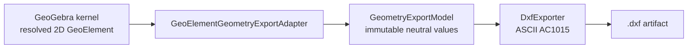
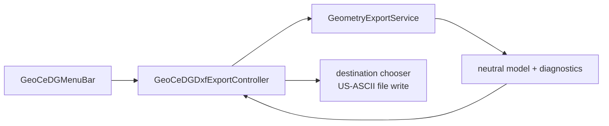

# Native 2D geometry export architecture

- Phase: G5
- Status: experimental
- Governing decision: [ADR 0005](../adr/0005-neutral-2d-geometry-export.md)
- Normative contract:
  [geometry export foundation](../../geocedg/specs/export/geometry-export-foundation.md)
- User workflow: [GeoCeDG user guide](../user/geocedg_user_guide.md)

## Purpose and boundary

G5 establishes a reusable read-only boundary between resolved dynamic geometry
and file formats:

The kernel remains the authority for object meaning and dependency evaluation.
The adapter reads that resolved state; it does not solve geometry. The neutral
model captures the information approved for export. The DXF writer only
encodes that model and has no access to `GeoElement`, `Kernel`, Euclidian
views, dialogs, or files.

This separation makes a future exporter a consumer of the same neutral model,
not another independent interpreter of GeoGebra internals. It also makes the
model testable without a Desktop dialog and the writer testable without a GUI.

## Baseline export audit

The pinned baseline contains useful export mechanisms, but no DXF support and
no intermediate model with the G5 contract.

| Baseline capability | Principal location | Architectural character | G5 reuse decision |
|---|---|---|---|
| PNG, PDF, SVG, EMF and EPS-style graphics export | `source/desktop/desktop/.../export/GraphicExportDialog.java` and FreeHEP graphics backends | Repaints an `EuclidianView`; physical/image scale and viewport participate | Retained unchanged for presentation exports; unsuitable as model geometry authority |
| PSTricks, PGF/TikZ and Asymptote | `source/shared/common/.../export/pstricks/GeoGebraTo*.java` plus Desktop frames | Traverses construction objects but combines view bounds, format policy and emission | Type-handling knowledge inspected; implementation not reused because it crosses the G5 boundary |
| STL and Collada | `source/shared/common/.../geogebra3D/euclidian3D/printer3D/` | Renderer-oriented 3D mesh output | Out of 2D G5 scope |
| Construction protocol export | `ConstructionProtocolExportDialogD.java` | Tabular construction-history presentation | Not a geometry format |
| Print preview and scale | `PrintPreviewD.java`, `PrintScalePanel.java` | Page/view presentation | Deliberately excluded from model-coordinate DXF |
| Desktop plugin SVG/PDF API | `GgbAPID.java` | Delegates to view-based graphics export | Preserved; not a neutral geometry DTO |

A repository search found no baseline DXF writer, menu action, dependency, DTO,
visitor, or adapter that could satisfy the required source/neutral/format
separation. G5 therefore adds a small controlled writer and does not replace
any upstream export path.

## Components and responsibilities

### Shared model and services

All shared G5 classes live in
`source/shared/common/src/main/java/org/geocedg/common/export/`.

`GeometryExportModel`

: Immutable aggregate containing the selection provenance, coordinate-system
  identifier, source/target unit, exact entities, and explicit diagnostics.
  Geometry values are typed records for points, linear objects, circles, arcs,
  ellipses, and polylines. Each entity carries a construction-revision source
  identifier, source type, optional label, normalized layer, RGB/visibility,
  exactness, and optional approximation tolerance.

`GeoElementGeometryExportAdapter`

: The sole G5 class permitted to inspect `GeoElement` subclasses. It maps
  already-resolved finite 2D values, normalizes directions, suppresses
  polygon-generated duplicate sides, and emits a diagnostic for every
  unsupported, undefined, non-finite, 3D, or degenerate source.

`GeometryExportService`

: UI-independent facade. `createModel(...)` adapts an already-selected source
  population and records its `SelectionMode`; `exportDxf(...)` encodes a
  supplied neutral model. It can be called by Desktop, tests, future batch
  automation, or a future DSL bridge without depending on dialogs.

`DxfExporter`

: Deterministic pair writer for ASCII DXF AC1015. It writes HEADER, LTYPE/LAYER
  tables and ENTITIES. It does not read source geometry or perform file I/O.
  Handles, layer order, entity order and numeric text are deterministic; no
  timestamp is emitted.

### Desktop access

`GuiManagerGeoCeDG` selects `GeoCeDGMenuBar` only for the GeoCeDG profile.
`GeoCeDGDxfExportController` owns population choice, confirmations, destination
selection, file I/O and user-visible diagnostics. None of these concerns enter
the shared writer. Classic continues to instantiate the existing
`GeoGebraMenuBar` through the default `GuiManagerD.newMenuBar()` factory.
The GeoCeDG menu has the `Alt+G` mnemonic and its DXF action has the
`Ctrl+Shift+D` accelerator; neither binding is installed by Classic.

## Neutral contract

The G5 coordinate system is `GEOGEBRA_CARTESIAN_2D_WORLD`: Cartesian world
coordinates of resolved 2D objects, exported with `z = 0` and an identity
transform. The current baseline has no approved physical model-unit contract,
so both source and target units are `UNITLESS` and DXF `$INSUNITS` is `0`.

The following inputs are structurally absent from the shared API:

- view pixel dimensions and bounds;
- zoom, DPI or axes ratio;
- printing or drawing-sheet scale;
- Swing components, file choosers and paths;
- 3D/projection bindings that belong to future phases.

Consequently a view change cannot alter the generated geometry. A future
explicit physical-unit contract may add a declared transform to the neutral
model; it must never derive model units from screen scale.

## Exactness policy and DXF mapping

| Resolved source | Neutral type | DXF entity | G5 fidelity |
|---|---|---|---|
| finite 2D point | `POINT` | `POINT` | exact coordinates |
| segment | `SEGMENT` | `LINE` | exact endpoints |
| ray | `RAY` | `RAY` | exact origin and normalized direction |
| infinite line | `INFINITE_LINE` | `XLINE` | exact base point and normalized direction |
| circle | `CIRCLE` | `CIRCLE` | exact center/radius |
| circular arc | `ARC` | `ARC` | exact center/radius/oriented angular bounds |
| ellipse or elliptic arc | `ELLIPSE` | `ELLIPSE` | exact center, major vector, ratio and parameter interval |
| polygon boundary | `POLYLINE` closed | `LWPOLYLINE` flag 1 | exact ordered boundary; no fill |
| polyline | `POLYLINE` open | `LWPOLYLINE` flag 0 | exact ordered vertices |

G5 has no approximate source adapter. `Exactness.APPROXIMATE` exists only as a
guarded extension seam and requires a positive finite tolerance. Functions,
parametric or implicit general curves, sectors, parabolas, hyperbolas,
degenerate conics, legacy `Locus`, text, images, widgets and 3D objects are
reported as unsupported. They are never silently tessellated.

This policy intentionally leaves legacy `Locus` unsupported before Locus V2.
The display polyline is not accepted as its geometric identity. A future
Locus V2 adapter may provide analytic/parametric data or a declared,
tolerance-controlled approximation without changing `DxfExporter`.

## Provenance, layers and style

Every emitted entity receives a deterministic DXF handle and a group `999`
comment containing its construction-revision source identifier. This provides
source-to-output validation correspondence but is not a new persistent object
identity contract.

Current integer layer mapping is deliberately minimal:

- layer `0` becomes DXF layer `0`;
- layer `n != 0` becomes `GEOCEDG_L<n>`;
- layer declarations follow first entity occurrence after layer `0`.

This adapter is not the hierarchical layer system planned for G11. G5 carries
object true RGB in group `420` and hidden state in group `60 = 1`. It omits
line thickness, dash, point size, fill and opacity because the baseline values
are presentation conventions, often pixel-based, rather than physical model
geometry.

## DXF profile

G5 writes ASCII DXF with `$ACADVER = AC1015` (AutoCAD 2000) and
`$INSUNITS = 0`. AC1015 provides native `LWPOLYLINE`, `RAY`, `XLINE` and
`ELLIPSE` entities while remaining simple enough for a small audited group-code
writer. The accepted ADR links to Autodesk's version/header documentation.

No external DXF library is introduced, so G5 adds no packaging dependency,
license component or SBOM entry. The shared/Desktop JARs already consumed by
G4 `installDist` carry the implementation into app-image, ZIP, MSI and EXE.

## Input modalities and errors

The first GUI modes are:

1. complete labeled 2D construction, in construction order;
2. explicit current selection, in selection order.

Selection is resolved by Desktop before calling the adapter. The service does
not inspect GUI selection state. The controller refuses an empty population or
a model with zero exportable entities. If supported and unsupported objects
coexist, it lists source identifiers, diagnostic codes and messages, then
requires explicit confirmation before writing only the supported subset.

## Validation method

`GeometryExportFoundationTest` creates a deterministic synthetic construction
containing a point, segment, circle, circular arc, polygon, polyline, line,
ray, ellipse and deliberately unsupported function. Its lightweight parser
reads group-code pairs and verifies:

- AC1015 and unitless header values;
- entity count, type and order;
- known segment endpoint, circle radius, polygon vertex count and closure;
- unit direction of `RAY` and `XLINE`;
- layer, true RGB and visibility mapping;
- source identifier correspondence;
- explicit unsupported diagnostics;
- refusal of approximate entities without tolerance;
- byte-equal DXF after a zoom/viewport coordinate-system change.

The versioned source and expected semantic evidence live in
`models/regression/g5-dxf-foundation/`; the regression catalog points to the
focused `tools/agent/verify-dxf.ps1`. The focused verifier is subordinate to
`tools/agent/verify.ps1`, runs shared/Desktop tests and checkstyle, validates
manifests and checks that the DXF writer cannot cross the neutral boundary.

A G5 DXF PASS means that the parsed geometric invariants and explicit loss
policy match the versioned evidence. It does not mean that every GeoGebra
object is supported, that units are physical, or that importing DXF back into
GeoCeDG is implemented.

## Controlled upstream impact

Only two pre-existing Desktop files require G5 edits:

- `GuiManagerD.java` gains a protected menu-bar factory whose default still
  returns the original Classic menu;
- `AppGeoCeDG.java` selects `GuiManagerGeoCeDG` for the fork profile.

All other G5 Java classes are GeoCeDG-owned additions under `org.geocedg`.
The exact controlled file list and purpose are recorded in
`docs/upstream/modified-files.yml`. Kernel algorithms, `Locus`, construction
serialization and Classic behavior are unchanged.

## Extension rules

A future format should consume `GeometryExportModel` or an explicitly evolved
version of it. A new source family belongs in the adapter only when its
resolved semantics are reliable and its exactness policy is approved. If a
capability changes the meaning, dependency behavior or serialization of a
geometric object, it is not an exporter change and must be designed in the
appropriate semantic phase.

G5 deliberately does not implement Locus V2, native 3D/projection semantics,
the Python DSL, hierarchical layers, drawing sheets, advanced PDF/SVG export,
or DXF import.
