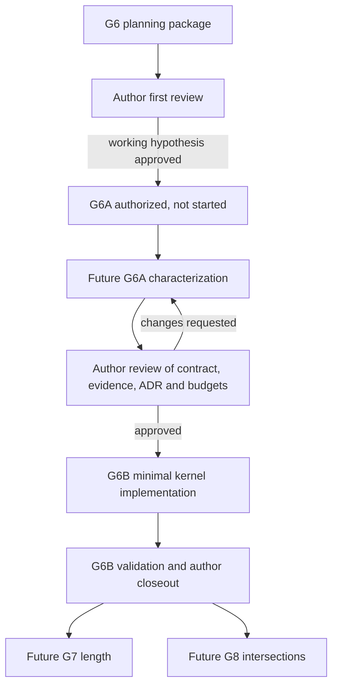

# G6 — Locus V2 executable planning package

| Field | Value |
|---|---|
| Planning status | **EXECUTED THROUGH G6A CHARACTERIZATION** |
| Project phase status | **G6A PASS — AUTHOR APPROVED**; G6B **NOT STARTED** |
| Baseline | GeoGebra 5.4.928.0, `9b93256b7df401ff056c37b502d82df4d72b1522` |
| Branch | `feature/g6a-locus-v2-characterization` |
| Document version | 1.3 G6A author-approved closeout |
| Review date | 2026-08-11 |
| Current disposition | Normative semantic contract and ADR 0006 accepted; G6A closed |
| Required next approval | Separate author authorization to execute G6B |

This package is the design-before-code gate for G6. It divides the work into
two independently reviewable tasks:

- **G6A — Mathematical and semantic characterization** establishes approved
  mathematical, numerical, compatibility and validation contracts. It may add
  read-only characterization tests/probes but no productive Locus V2 kernel
  implementation.
- **G6B — Minimal kernel implementation** starts only after G6A passes and its
  architecture decision is approved. It implements the smallest experimental
  entity that demonstrates the new semantics; it does not implement public
  length (G7), intersections (G8) or spatial semantics (G9).

The governing phase order remains the
[living roadmap](geocedg_roadmap.md). The author approved this package as G6A's
working hypothesis; G6A produced and the author approved its contract and
evidence. G6B is deliberately `NOT STARTED` and requires a separate task.

## 1. Planning authorities and produced artifacts

The package applies, in order, `AGENTS.md`, the living roadmap, accepted ADRs,
normative specs, G0–G5 reports, baseline architecture maps, pinned source,
cataloged CeDG research and curated legacy/regression evidence. It does not
treat a legacy macro or paper claim as an executable kernel contract without
characterization.

| Artifact | Role | Authority state |
|---|---|---|
| [Semantic model](../architecture/locus_v2_semantic_model.md) | Mathematical object, branch/domain/evaluator/quality/degeneration/nesting explanation | G6A author-approved supporting architecture |
| [Upstream impact map](../architecture/locus_v2_upstream_impact.md) | Exact baseline command/object/render/serialization map and minimum change strategy | G6A audit accepted; no productive change made |
| [Validation matrix](../validation/g6_locus_v2_validation_matrix.md) | Cases, invariants, expected evidence, phase and tolerance owner | G6A PASS evidence and approved future G6B gate |
| [Benchmark plan](../validation/g6_locus_v2_benchmark_plan.md) | Legacy/nested baselines, semantic/render metrics and budget method | G6A baseline and functional budgets accepted; absolute timings informational |
| [ADR 0006](../adr/0006-parallel-locus-v2-semantic-entity.md) | Parallel V2 entity and nested-composition decision | **Accepted** |
| [G6A prompt](../../.github/prompts/tasks/g6a-locus-v2-characterization.prompt.md) | Historical executable characterization task | Executed and closed; [report](../validation/g6a_locus_v2_characterization_report.md) author-approved |
| [G6B prompt](../../.github/prompts/tasks/g6b-locus-v2-kernel.prompt.md) | Independently executable implementation task | Ready as a contract; **NOT STARTED** |

G6A created a normative spec, validation records and test-only Java probes. It
created no feature manifest, productive V2 Java source or serialization
contract. Product implementation remains a future G6B deliverable after
approval.

## 2. Outcome and hard boundary

G6 succeeds scientifically only if it replaces this implicit identity:

```text
locus == sampled drawable point list
```

with this explicit separation:

```text
driver domain + branches + dependency evaluator
                     = semantic Locus V2
                               |
                               +--> view-local render tessellation
                               +--> future G7 metric index
                               +--> future G8 intersection solver
                               +--> future G9 parameter correspondence
                               +--> future G5 neutral export adapter
```

G6 is not a request for a denser polyline. Zoom, DPI, viewport and render time
budget may affect only the derived tessellation. They may not affect semantic
domain, branches, point evaluation, future length or future intersections.

## 3. Baseline findings that constrain execution

1. `CmdLocus` selects path-point and slider algorithms through
   `AlgoDispatcher`; existing commands must remain legacy in G6B.
2. `AlgoLocusND`/`AlgoLocusSliderND` build a cloned dependency slice but then
   drive adaptive sampling with Euclidian scales, a 500 ms step budget and a
   traversal cap based on `10,000 * participating views`.
3. `GeoLocusND.myPointList` is both drawable data and current `Path` authority;
   its path parameter is a sample index with interpolation.
4. current `Length[ locus ]` reports sample count and perimeter sums sample
   chords; neither is a V2 metric contract.
5. the public `PathParameter[...]` command normalizes native path parameters to
   `[0,1]`; neither that coordinate nor a native parameter is V2 identity unless
   a versioned driver-domain provider explicitly declares it suitable/stable.
6. function path bounds come from the current view—even an explicit function
   interval is clipped to it—and cannot be a V2 domain; a provider would need
   the construction-owned interval independently.
7. `kernel.isContinuous()` admits traversal-history effects; G6A must classify
   pointwise determinism, canonical-continuation determinism and unsupported
   nondeterminism for each selected real construction.
8. existing XML has only `GeoClass.LOCUS` / `locus` mapped to `GeoLocus`; there
   is no versioned V2 persistence type.
9. the experimental feature catalog is metadata, not a shared-kernel runtime
   flag implementation.
10. G5 explicitly rejects legacy locus export; G6 does not change that.
11. legacy loci can act as sampled `Path` inputs to downstream loci; the
    author's two-/three-level degradation observation must be reproduced before
    attributing it to samples, slices, repeated updates or render coupling.
12. using `GeoClass.LOCUS` for V2 versus introducing a distinct classification
    remains undecided pending a complete G6A switch/contract audit; the author
    prefers a distinct type if impact is reasonably localized.

These constraints support the author-approved G6A working hypothesis: a
parallel experimental kernel element with new V2-only semantic interfaces,
normal graph dependencies and derived rendering. Legacy remains a comparison
implementation and is not retrofitted to claim V2 semantics.

## 4. Execution dependencies and approval sequence



G6A and G6B are independent task scopes and should use separate feature
branches/commits/reports. G6B depends on G6A's approved outputs; it must not run
speculatively in parallel with G6A.

## 5. G6A — Mathematical and semantic characterization

### 5.1 Objective

Produce the normative, measured and author-approved contract that makes a
minimal implementation unambiguous. G6A closes with no productive V2 object
required.

### 5.2 Work packages

#### G6A.1 Freeze evidence and provenance

- record Git SHA, baseline tag, Java/Gradle toolchains and exact legacy source
  files/methods from the upstream impact map;
- hash each local `.ggb`/`.ggt` scientific pilot and retain original artifacts
  unchanged;
- link each model to its publication/catalog entry, GeoGebra origin/version
  when known, driver and relevant tool;
- keep public remote models metadata-only unless the author approves a small
  curated download with provenance and hash.

#### G6A.2 Characterize legacy behavior

- reproduce command dispatch, sampled point list, path/sample-index behavior,
  view-driven recompute, timeout and existing metric behavior;
- compare native path parameters with public normalized `PathParameter` for
  segment, circle/ellipse, line, ray, parabola, hyperbola and explicit-domain
  curve/function cases;
- measure point/sample/perimeter variation across zoom and viewport;
- test forward, reverse and shuffled evaluation on constructions affected by
  continuous branch tracking;
- inspect, without modifying, `Templatev7.ggb`, `postLocus`, `listLength`
  (publication role `locusLength`), `listLength12` (publication role
  `locusLength12`) and the oblique-cone chained-locus workflow;
- reproduce the author's legacy `Locus -> Locus` observation and, when the
  artifact is reproducible, `Locus -> Locus -> Locus`; instrument dependency
  slice build/reset/update, sample-path reads, repeated calls and render/view
  work before proposing a causal explanation;
- record contradictions by source version instead of silently harmonizing
  them.

#### G6A.3 Approve the mathematical contract

- define versioned driver-domain providers, provider-owned semantic parameters,
  explicit mappings to native parameters where proven suitable/stable, oriented
  declared domains, finite/infinite/open/closed endpoints and periodicity;
- define a branch as a semantic constructive solution/leaf with deterministic
  `branchKey`, declared domain and `validDomainComponents[]`; never create a
  branch identity merely because the valid subset becomes disconnected;
- distinguish `(locus identity, branchKey,t,revision)` from the Cartesian point
  and preserve multiple preimages;
- approve branch identity/lineage for appear, disappear, split, merge, crossing
  and apparent orientation changes;
- formalize the two-parameter topology fixture that independently exercises
  valid-component splitting/isolated states/empty domain and typed branch
  split/merge lineage;
- separate definition status, branch/domain properties, evaluation status,
  optional regularity and topology transition/lineage;
- approve the four quality axes—construction fidelity, evaluation method,
  representation role and numeric guarantee—and ban “many samples = exact”.

The candidate starting point is the
[semantic model](../architecture/locus_v2_semantic_model.md). G6A must issue a
normative version under `geocedg/specs/` only after author approval.

#### G6A.4 Approve drivers and evaluator boundary

- characterize path-point and numeric-slider drivers separately under a small
  common protocol;
- enumerate type-specific semantic domain providers for G6B;
- reject view-derived function domains unless an explicit interval is owned by
  the construction;
- specify immutable evaluation result/status/quality metadata;
- classify every selected evaluator as `POINTWISE_DETERMINISTIC`,
  `CANONICAL_CONTINUATION_DETERMINISTIC` or
  `UNSUPPORTED_NONDETERMINISM`, including canonical anchor/orientation/rule;
- decide whether derivative/tangent/bounds remain optional capabilities (the
  candidate recommendation) or any is essential to G6B;
- prove query-history-independent results for pointwise and canonical-
  continuation cases, or exclude the case explicitly.

#### G6A.5 Approve graph, invalidation and cache policy

- verify the normal `AlgoElement` input/output set for each driver family;
- prototype only the characterization necessary to prove that the cloned
  dependency slice can be synchronized once per recompute and evaluated from a
  canonical branch state;
- define the local semantic revision and ensure `Construction.getStep()` is not
  misused as one;
- approve immutable definition snapshots, optional bounded evaluation cache
  and per-view render cache;
- audit ordinary DAG cycle protection and require explicit diagnostic re-entry
  protection for any evaluator callbacks not covered by declared inputs;
- retain kernel-thread confinement; do not design concurrency without evidence.

#### G6A.6 Characterize nested semantic composition

- model an upstream V2 locus as an explicit normal-DAG input whose only
  consumable interface is branch/domain/evaluator/revision/validity/quality;
- compare (A) recursive semantic evaluator composition with a scoped shared
  evaluation session and (B) controlled DAG flattening/compilation when safe;
- decide whether an evaluation-session abstraction is necessary, without
  accepting a class name prematurely;
- use a cache identity that includes locus identity, semantic revision,
  `branchKey` and provider-owned semantic parameter;
- prove cache/session enabled and disabled results equal, correct innermost
  invalidation, no upstream render access and no whole-locus/slice rebuild per
  downstream point;
- measure `NESTED-1`, `NESTED-2`, `NESTED-3` and, when useful, `NESTED-5` before
  selecting the minimum G6B strategy.

#### G6A.7 Validate scientific corpus and assign phases

- approve all Level A analytic fixtures;
- characterize Level B branch/topology/degeneration fixtures;
- characterize all required Level C CeDG families;
- select the exact G6B real pilot(s), with a dependency-chain case, oblique-cone
  legacy benchmark and discrete topology case as minimum evidence;
- allocate metric claims to G7 and intersection/root claims to G8.

The [validation matrix](../validation/g6_locus_v2_validation_matrix.md) is the
candidate inventory and phase assignment.

#### G6A.8 Measure and approve performance budgets

- add no production optimization;
- implement a focused read-only probe only as needed to separate legacy
  recompute, evaluation/traversal and rendering;
- run the simple, dependency-chain, multibranch, concatenated, nested-depth,
  oblique-cone, discrete and stress baselines;
- record raw distributions, sample/evaluation counts, cache/memory observations
  and zoom sensitivity, including per-level evaluator calls, duplicated
  upstream calls and dependency-slice build/synchronization counts;
- propose author-approved functional sizes and budgets after measuring noise.

The [benchmark plan](../validation/g6_locus_v2_benchmark_plan.md) is the
candidate protocol. G1 benchmark budgets remain informational unless a
reviewed schema change says otherwise.

#### G6A.9 Resolve architecture and non-persistence boundary

- review alternatives A–E against measured evidence;
- accept, amend, reject or supersede
  [ADR 0006](../adr/0006-parallel-locus-v2-semantic-entity.md);
- preserve the approved G6B boundary: non-persistent, no public command, no
  `Locus[...]` redirection, no `.ggb` migration and no public V2 `Path`;
- audit `GeoClass.LOCUS`, `isGeoLocus()`, `isGeoLocusable()`, drawing, defaults,
  labels, metrics, `Path`, factory/XML and 2D/3D dispatch, then recommend a
  classification for the author-review gate;
- resolve nested evaluation-session/DAG strategy and exact cycle protection;
- fix the exact G6B classes/packages and minimum upstream files.

#### G6A.10 Operational and documentary integration

- create a focused characterization verifier subordinate to
  `tools/agent/verify.ps1`;
- add deterministic CI only for stable, bounded checks;
- create the G6A report with source hashes, methods, raw-result locations,
  contradictions and author decisions;
- update the living roadmap and the user guide's conceptual/history material,
  clearly stating that no user-visible V2 exists yet.

### 5.3 G6A durable deliverables

- accepted or explicitly revised semantic spec under `geocedg/specs/`;
- accepted ADR 0006 (or an explicitly superseding accepted ADR);
- completed upstream/legacy characterization report and reproducible probes;
- formal topology fixture and nested-composition causal/performance evidence;
- curated pilot manifests/hashes where authorized;
- approved validation matrix with numeric tolerance definitions;
- measured benchmark baseline and approved G6B budgets;
- exact G6B change/file plan;
- focused subordinate verifier and G6A validation report;
- user-guide/roadmap updates that do not claim implementation.

G6A produced every deliverable and the second author review accepted the
semantic contract, compatibility classification, nested strategy, numeric
validation envelope, functional budgets and scientific-evidence roles. The
report links each artifact and documented exclusion.

### 5.4 G6A PASS criteria

G6A may be `PASS` only when all are true:

- mathematical contract and parameter/domain policy are author-approved;
- branch identity, valid-domain components and dynamic topology lineage are
  author-approved using the formal deterministic fixture;
- separated state taxonomy, determinism categories and four-axis quality model
  are complete;
- upstream map is verified against the pinned baseline;
- legacy Locus behavior, including view dependence and call-order risk, has
  reproducible evidence;
- legacy two-/three-level nesting has reproducible evidence and the measured
  mechanism is distinguished from the author's initial observation;
- V2 nested strategies are compared; session/cache identity, DAG/cycle policy
  and the minimum G6B approach are approved;
- the `GeoClass` compatibility audit and classification recommendation are
  complete;
- every required scientific case has an owner and G6B/G7/G8 assignment;
- tolerances have units, derivations and approved values;
- legacy benchmarks and measurement noise are recorded;
- G6B budgets and restricted driver/model scope are approved;
- ADR 0006 has an explicit author disposition;
- no productive Locus V2 kernel implementation was needed to claim G6A PASS.

The second author review confirms that every criterion above is satisfied.
The accepted numeric envelope is a non-certified comparison policy; it does
not turn floating-point output into exact arithmetic. Absolute timing values
remain informational for future G6B execution.

### 5.5 G6A closeout state

Completed characterization:

- legacy sample/view/path/metric, multibranch and dependency-slice probes;
- formal branch/component/lineage fixture;
- Level-A order-independent analytic references;
- nested recursive/flattened reference comparison through depth five;
- scoped-session memoization equality and hidden callback-cycle detection;
- complete `GeoClass.LOCUS`, predicate, drawing, defaults, metric, `Path`, XML
  and 2D/3D dispatch audit;
- scientific case classification, two hash-pinned cone-cylinder models and
  explicit remaining provenance exclusions;
- reproduced two-/three-level legacy transition with macro-slice and timeout
  instrumentation;
- subordinate operational verifier and worktree-preserving cleanup.

Author-approved closeout decisions:

- the semantic specification is normative and ADR 0006 is `Accepted`;
- G6B uses a distinct appended V2 classification, preserves existing enum
  ordinals, and claims no legacy locus predicates/contracts;
- recursive semantic evaluators plus a scoped shared session, full semantic
  key, bounded memoization and active-key cycle protection form the minimum
  nested strategy; controlled DAG flattening is deferred;
- `max(1e-12 * max(1,S), 64 * ulp(max(1,S)))` is the G6B uncertified comparison
  envelope, with case-documented geometric `S` independent of screen state and
  origin offset; other tolerance families remain separate; and
- the two supplied models are complementary legacy evidence, not persisted V2
  pilots or redistributable release assets.

The small controlled fixture remained functional, but the author-supplied real
model reproduced the severe third-level failure. The two-level control measured
approximately 125–127 ms. In the pathological model, the state before
`Flatten` measured approximately 31.9 ms; the three third-level locus creations
took approximately 6.03, 5.95 and 5.67 s, each ended undefined after exceeding
the 500 ms legacy step limit, and recomputation after the attempt took
approximately 21.0 s. Each `Flatten` macro slice contains two inner legacy loci
and two sampled `AlgoPerimeterLocus` instances, and its outer
`AlgoLocusSliderND` repeatedly updates that slice. This is the observed cause
for these fixtures, not a general claim about every legacy locus.

G6B will use a small internal typed three-level reproduction traced to both
originals. It must prove composition, inner invalidation, no render/sample
dependency, no whole-upstream-locus regeneration and accepted functional
scaling without implementing G7 `Perimeter` semantics.

## 6. G6B — Minimal kernel implementation

### 6.1 Entry conditions

G6B may start only from a clean branch after:

1. the author issues a separate explicit G6B implementation task;
2. G6A is committed and reported `PASS`;
3. the author has approved the semantic spec, validation matrix, numeric
   tolerances, budgets and exact pilot set;
4. ADR 0006 or a superseding architecture decision is `Accepted`;
5. the accepted spec preserves the approved non-persistent/no-command/no-public-
   `Path` G6B boundary;
6. the existing full operational authority passes.

### 6.2 Minimal implementation scope

G6B must demonstrate exactly:

1. an experimental two-dimensional V2 kernel entity;
2. immutable definition/domain independent of render;
3. deterministic point evaluation for the approved subset;
4. explicit branches and stable identities;
5. normal dependency input/output and invalidation behavior;
6. render derived exclusively from evaluator calls;
7. semantic invariance across zoom/DPI/viewport changes;
8. unchanged legacy `Locus` and Classic behavior;
9. explicit `cedg.locus.v2` runtime selection and dual diagnostic mode;
10. internal typed V2-on-V2 semantic composition through at least three levels;
11. a distinct appended V2 classification that preserves existing ordinals and
    claims neither legacy locus predicate;
12. tests, regression evidence and approved benchmarks.

### 6.3 Implementation work packages

#### G6B.1 Semantic value types and API

- implement the approved immutable provider/domain/valid-component, branch,
  definition, evaluation, separated status and four-axis quality types in a
  GeoCeDG-owned shared package;
- keep derivative/tangent/bounds as explicit optional capabilities when the
  approved G6A contract defers them;
- expose no mutable render point list and no public final API promise.

#### G6B.2 Drivers and deterministic evaluation context

- implement only approved finite/unbounded path providers and numeric driver;
- synchronize a dependency slice once per normal recompute;
- evaluate under the approved pointwise or canonical-continuation contract
  without mutating the live construction or rebuilding an informal graph per
  sample;
- report unsupported nondeterminism explicitly;
- implement recursive semantic evaluators with the approved scoped shared
  session, full-key bounded memoization and active-key cycle protection, and demonstrate
  three levels through an internal typed API/factory.

#### G6B.3 Kernel object and dependency algorithm

- implement parallel `GeoLocusV2` and the approved `AlgoLocusV2` family (names
  and number of algorithms may be refined by the accepted spec);
- append a distinct V2 `GeoClass`/classification without changing existing
  ordinals; keep `isGeoLocus()` and `isGeoLocusable()` false and do not enter
  legacy `Path`, metrics, commands, XML or 3D dispatch;
- register complete standard input/output dependencies;
- publish one immutable semantic snapshot with a monotonic local revision;
- clear/invalidate state on undefined driver/dependency or failed evaluation;
- do not implement public `Path`/incidence until G7/G8 contracts support
  preimages; nested composition uses the internal semantic evaluator only.

#### G6B.4 Derived rendering

- add a dedicated drawable and per-view render cache;
- tessellate adaptively under an explicit pixel policy using evaluator results;
- keep view clipping/range only inside the render layer, especially for
  unbounded branches;
- prove cache eviction/rebuild cannot change semantic results;
- preserve stroke/freehand locus and 3D dispatch.

#### G6B.5 Compatibility modes

- implement a real, explicit runtime mode instead of reading feature-manifest
  metadata as executable state;
- keep GeoCeDG default behavior and author-approved experimental access clear;
- keep Classic and legacy files on V1;
- dual mode reports V1 sampled observations versus V2 evaluations without
  declaring V1 geometric authority;
- do not replace or redirect the public `Locus` command in any mode;
- create no persistence, `.ggb` migration or public V2 `Path` behavior.

#### G6B.6 Validation and performance

- implement all required Level A, selected Level B and approved Level C tests;
- run zoom, render separation, determinism, dependency, branch identity,
  compatibility and no-stale-result invariants;
- run V2 cache enabled/disabled reference comparisons;
- validate `NESTED-1` through `NESTED-3` (and approved stress depth), including
  per-level call counts, no render access, no upstream full-locus regeneration,
  bounded scaling and innermost-source invalidation;
- enforce approved functional budgets and initially informational timing gates
  according to the benchmark contract;
- add `tools/agent/verify-locus-v2.ps1` subordinate to `verify.ps1` and only
  deterministic bounded CI coverage.

#### G6B.7 Product contracts and documentation

- register `cedg.locus.v2` as `experimental`, its modes, defaults and limits in
  existing manifests/spec schemas;
- record every modified upstream file and purpose;
- update the user guide with actual observable access, diagnostic comparison,
  semantics/render distinction, exactness, degenerations and limits;
- update architecture/validation evidence and roadmap phase state;
- produce a G6B report that confirms G7/G8/G9 and DXF locus export did not
  start.

### 6.4 Intentionally excluded from G6B

- changing `Locus[...]` for existing or new Classic constructions;
- public `LocusLength`, perimeter semantics or metric index;
- line/circle/locus intersection commands or incidence;
- V2 as a general `Path` before preimage ambiguity is approved;
- public `Point[GeoLocusV2,...]` or `PathParameter[GeoLocusV2]`;
- DXF/SVG/PDF locus encoding;
- 3D objects or cross-projection semantics;
- automatic legacy migration;
- any `.ggb` persistence, hidden or explicit, in the G6B demonstrator;
- unrestricted view-domain functions and uncharacterized history-dependent
  constructions;
- concurrency framework, broad `GeoLocus` refactor or premature optimization.

### 6.5 G6B PASS criteria

G6B may be `PASS` only when saved evidence proves:

- the experimental V2 entity exists and is selected only through its approved
  feature/mode path;
- its definition, branches and evaluator are independent of all view state;
- approved finite and unbounded domains work with explicit endpoint/status
  policies;
- branch identities remain stable while topology is unchanged and follow the
  approved lineage policy when it changes;
- repeated/shuffled evaluations in one semantic revision are deterministic;
- canonical-continuation cases reproduce the same result from fresh and warmed
  evaluation sessions;
- normal dependency changes publish coherent new revisions and no stale
  geometry;
- render tessellation changes as needed across zoom while semantic results do
  not;
- legacy `Locus`, representative `.ggb`, GeoCeDG diagnostic V1 and Classic all
  retain baseline behavior;
- `LEGACY`, `V2` and `DUAL` modes are tested and dual output labels its evidence;
- at least three nested V2 levels return correct geometry and coherent
  revisions/branch keys without consulting upstream render caches, regenerating
  upstream loci or rebuilding dependency slices per downstream point;
- nested results are identical with session/cache enabled and disabled,
  innermost changes invalidate the whole affected chain correctly, and scaling
  stays within the G6A-approved budget;
- approved performance/cache budgets pass without degrading disabled/legacy
  behavior;
- shared/Desktop build, checkstyle, tests, manifests/schemas, regressions,
  composed verification, launch smoke, `git diff --check`, generated-output
  cleanup and residual-process checks pass;
- no public G7 length, G8 intersection, G9 spatial or locus-export feature was
  implemented.

## 7. Scientific case allocation

| Level | G6A | G6B | G7 | G8 |
|---|---|---|---|---|
| Analytic line/circle/ellipse/parabola/transcendental | Define invariants, domains and tolerances | Required evaluator/render tests | Circle/ellipse/parabola metric references | Roots/tangencies when introduced |
| Multibranch/closed/self-intersection/cusp/discontinuity/unbounded | Define topology and validity semantics | Required selected topology/status tests | Oriented/multibranch lengths | Multiplicity, tangency and stable roots |
| Formal two-control topology/lineage fixture | Approve analytic branch/component distinction and typed transitions | Required definition/lineage/invalidation test | Not applicable | Future identity regression |
| Synthetic nested `NESTED-1/2/3/5` | Compare evaluator-session/DAG strategies and scaling | Three levels required; depth 5 only if approved | Future nested metric consumers | Future nested intersection consumers |
| Cone–cylinder | Characterize leaves/topology and reproduced two-/three-level legacy behavior using the hash-pinned pair | Use a small internal typed nested fixture traced to the originals; retain originals as manual/scientific comparison only | No metric implementation; preserve the forward derived-service rule | Primary native intersection case |
| Focal sphere–cone | Characterize provenance/invariants | Optional curated smoke | As relevant | Primary intersection case |
| Cylinder development | Characterize driver/dependencies | One possible dependency pilot | Developed length evidence | Only if construction intersections require it |
| Oblique-cone development | Required legacy/error/benchmark characterization | Required legacy benchmark; V2 pilot if deterministic | Primary length/error case | Intersection subprocedures later |
| Discrete elbow/development | Separate integer topology parameter from continuous locus parameter | Required invalidation/topology pilot | Metric comparison | Later geometric intersections as needed |
| General developable | Classify exact construction versus `acc` discretization | Diagnostic/benchmark or explicit unsupported result | Metric behavior | Regression-edge/intersection work as approved |

## 8. Numerical strategy and ownership

The staged capability model is:

1. use analytic/symbolic evaluation where the approved driver/construction
   exposes it;
2. otherwise use deterministic floating-point execution of the dependency
   construction under pointwise or canonical-continuation rules;
3. use adaptive subdivision only to build the render representation in G6B;
4. add controlled metric error in G7 and root/residual error in G8.

Any future G7 metric used by a downstream construction must preserve semantic
composition: it is scoped to the upstream locus semantic revision, consumes V2
semantic data rather than render samples or sampled chords, avoids complete
metric recomputation for every downstream query while that revision is
unchanged, and follows normal-DAG invalidation and caching. This is a future
architecture requirement, not a G6 implementation.

G6B does not need symbolic derivatives for arbitrary constructions. Optional
derivative/tangent/bounds capabilities may return `unsupported`; they must
never return guessed finite differences under an “exact” label. Analytic method
and construction fidelity do not imply `EXACT_ARITHMETIC`; numeric guarantee is
reported separately. Geometry, domain, render, metric and intersection
tolerances remain separate authorities.

## 9. Risk register

| Risk | Detection | Mitigation / decision owner |
|---|---|---|
| Dependency evaluation is traversal-history dependent | G6A shuffled-order experiments | Restrict supported subset or approve typed canonical continuation; author |
| Path min/max hides multiple branches or view dependence | Type-by-type domain characterization | Explicit providers; reject unsafe generic path fallback |
| Branch identity changes under topology | Level B and CeDG dynamic cases | Approved provenance/lineage policy; no proximity matching |
| V2 type collides with legacy type/render switches | Completed `GeoClass`/predicate/default/metric/Path/2D–3D audit | Use the accepted distinct appended classification; keep G6B non-persistent |
| Feature manifest mistaken for runtime flag | Mode integration test | Add minimal explicit runtime setting; Classic default legacy |
| MacroKernel duplicates/rebuilds too much work | `BM-CHAIN` and evaluation counters | Build/synchronize once per revision; optimize only from evidence |
| Nested loci multiply slice/sample/render work | `BM-NESTED-1/2/3/5`, per-level calls and slice counters | Semantic evaluator composition only; compare scoped session with controlled DAG plan |
| Evaluator callbacks create a hidden cycle | Declared-input audit plus active-evaluation-stack fixture | Reject cycle with typed diagnostic; no callback-only dependency |
| Render cache leaks into semantics | API/static tests and cache eviction | One-way read-only evaluator dependency; no render list in semantic API |
| Scientific “exact” terminology overclaims double results | Quality review and case evidence | Four independent axes including numeric guarantee |
| Real CeDG corpus is remote, copyrighted or too complex | Provenance and local availability gate | Metadata-only remote corpus; curate only approved pilots |
| Performance budgets selected before evidence | Benchmark report review | G6A measurement first; author approves numeric gates |
| Scope expands into G7/G8 | API/report review | Keep metric/intersection capabilities optional or unsupported; stop condition |

## 10. Blockers and stop conditions

Planning found no blocker to author review. Execution must stop if any of these
conditions occurs:

- no deterministic evaluator can be defined for the approved minimum cases;
- branch identity/topology policy remains unapproved;
- no bounded semantic strategy can support three nested V2 levels without
  render data, whole-locus regeneration or hidden dependencies;
- classification impact cannot be localized or reviewed without changing
  legacy semantics;
- G6B is required to change existing `Locus` or legacy `.ggb` meaning;
- persistence is required without a versioned serialization/migration decision;
- a semantic domain can only be obtained from viewport state;
- implementation would use render samples as length/intersection/export truth;
- a source license/provenance issue prevents use of a required pilot;
- a new external dependency or concurrent kernel model is required without
  separate review;
- validation cannot distinguish construction approximation from render
  discretization;
- work would implement G7, G8, G9 or alter G5's locus policy.

## 11. Author-approved G6A closeout decisions

The author has recorded these decisions:

1. the semantic specification is **APPROVED AS NORMATIVE G6 SEMANTIC CONTRACT**
   and ADR 0006 is `Accepted`;
2. a versioned provider owns the semantic parameter; native and normalized path
   parameters are not automatic identities;
3. semantic branch identity is distinct from valid-domain components, with
   deterministic branch keys and typed lineage;
4. pointwise and canonical-continuation determinism are supportable categories;
5. definition/evaluation state, branch properties, regularity and lineage are
   separate, as are the four quality axes including numeric guarantee;
6. G6B may be non-persistent, internal-only, without public `Path`, command or
   `.ggb` migration; diagnostic modes never redirect `Locus[...]`;
7. nested V2 semantic composition is first-class and G6B must demonstrate at
   least three levels without render/sample authority or whole-locus recursion;
8. G6B uses a distinct appended V2 classification, preserving all existing
   ordinals and claiming neither legacy locus predicate nor legacy contracts;
9. recursive semantic evaluators plus a scoped shared session with full keys,
   bounded memoization and active-key cycle protection are the minimum nested
   strategy; controlled DAG flattening is deferred pending profiling;
10. the scale-aware formula recorded in the semantic contract is accepted only
    as an uncertified G6B comparison envelope; and
11. the two supplied `.ggb` files are accepted in distinct control/pathological
    evidence roles, with public redistribution still blocked.

The scientific originals do not have to become persisted V2 constructions.
The required G6B pilot is the smaller internal typed reproduction traced to
them. Absolute timings remain informational.

## 12. Planned user-guide and monograph evidence

G6A added a conceptual/history section to
`docs/user/geocedg_user_guide.md` explaining the legacy sampled object,
scientific evidence, mathematical definition, parameter versus point, branch
identity, exactness and degenerations. It explicitly says that V2 is not yet
available to users.

G6B must then document only observed behavior:

- how to enable/disable V2 and dual diagnostics;
- supported drivers/domains and unsupported cases;
- semantic evaluator versus render tessellation;
- zoom invariance and deterministic dependency behavior;
- compatibility with Classic/legacy files and the persistence limit;
- measured performance/cache policy;
- nested semantic composition, invalidation and measured scaling;
- why V2 is neither a spline nor a sampled polyline;
- future boundaries to G7, G8, G9 and G5 export.

The semantic spec, ADR, upstream impact map, validation matrix, raw
characterization evidence, benchmark results and reports must retain links from
requirement through decision, implementation and validation so a future
monograph does not need to reconstruct the rationale from commits.

## 13. Planned verification commands

Exact focused class names may be refined during G6B, but execution remains
subordinate to the existing authority. The G6B gate is:

```powershell
.\tools\agent\verify-locus-v2.ps1
.\tools\agent\verify.ps1 -RunBenchmarks
.\gradlew.bat :shared:common:compileJava :shared:common-jre:test `
  :shared:common:checkstyleMain :shared:common-jre:checkstyleTest `
  :desktop:desktop:compileJava :desktop:desktop:test `
  :desktop:desktop:checkstyleMain :desktop:desktop:checkstyleTest
.\gradlew.bat :desktop:desktop:runGeoCeDG
.\gradlew.bat :desktop:desktop:run
git diff --check
```

The focused verifier must validate schemas/manifests/regression evidence and
clean its own regenerable outputs. Manual launches supplement saved automated
semantic evidence; screenshots are not geometric authority.

## 14. G6A disposition

The author accepts **parallel experimental V2 plus V2-only reusable semantic
interfaces**, a non-persistent/non-public G6B demonstrator,
provider-owned semantic parameters, explicit branches and valid components,
recursive nested evaluator composition with a scoped session, a distinct V2
classification and completely separate semantic/render caches. This closeout
does not authorize or start implementation.

**G6A = PASS — AUTHOR APPROVED. ADR 0006 = ACCEPTED. G6B = NOT STARTED.**
