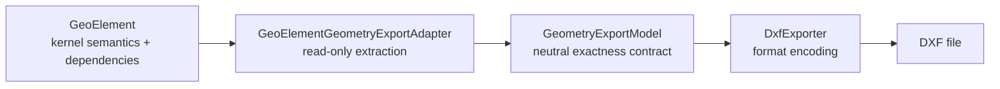

# Manual operativo vivo de GeoCeDG

- Tipo de documento: manual operativo vivo
- Puerta actual del proyecto: G6 **PASS**; G6R **PASS**
- Baseline: GeoGebra 5.4.928.0 at
  `9b93256b7df401ff056c37b502d82df4d72b1522`
- Plataforma validada: únicamente Windows
- Última revisión: 2026-08-13
- Fase actual: G7A-R1, G7A y G7B (`PASS — AUTHOR APPROVED`); G7 (`PASS`)
- Locus V2: `experimental`, internal/developer-only, disabled by default
- `PACKAGING TECHNICAL STATUS = PASS`
- `PUBLIC REDISTRIBUTION STATUS = BLOCKED PENDING LICENSE/ASSET APPROVAL`

This guide is the practical entry point for the GeoCeDG author/developer. It
describes product behavior available through G6R, G7A characterization
evidence and the author-approved internal G7B metric kernel. It does not replace the
[repository README](../../README.md),
[living technical roadmap](../roadmap/geocedg_roadmap.md), ADRs, specifications, or
architecture documentation.

## Run GeoCeDG now

From an already prepared clone, open PowerShell 7 at the repository root and
run:

```powershell
.\gradlew.bat :desktop:desktop:runGeoCeDG
```

## Can I use Locus V2 now?

| Reader | What is available now | What is not available |
|---|---|---|
| Normal GeoCeDG user | Public `Locus[...]` continues to use the unchanged legacy `GeoLocus` | No public V2 command, toolbar/menu, saved `.ggb`, `Path`, length, intersection or export |
| Classic diagnostic user | Unchanged legacy `Locus[...]` only | No V2 and no developer laboratory |
| Authorized developer | Opt-in visual laboratory, internal factory, semantic evaluator/tests and focused verifier | The laboratory is not a stable product UI and its generated construction cannot be saved |

Validate or open the developer-only laboratory from the repository root:

```powershell
.\tools\locus-v2\open-locus-v2-laboratory.ps1 -ValidateOnly
.\tools\locus-v2\open-locus-v2-laboratory.ps1
```

The second command runs `:desktop:desktop:runLocusV2Laboratory` with temporary
preferences. The window title is `GeoCeDG - Locus V2 Developer Laboratory` and
a separate diagnostics window shows semantic identity, revision, provider,
branches/domains/lineage, quality/status axes, session counters and render
vertices. Close both windows to finish Gradle. This opt-in route is absent from
normal GeoCeDG and Classic.

Close the application window normally to let Gradle finish successfully.

The experimental 2D DXF workflow is available inside GeoCeDG at
`GeoCeDG > Export 2D geometry as DXF (experimental)...`. It is not present in
the Classic diagnostic application.

To run an app-image that has already been generated, without installing it:

```powershell
& .\artifacts\packaging\windows\app-image\GeoCeDG\GeoCeDG.exe
```

For a new workstation, use:

```powershell
git clone https://github.com/mpradovelasco/GeoCeDG.git
cd GeoCeDG
.\tools\bootstrap\bootstrap-windows.ps1
.\gradlew.bat :desktop:desktop:runGeoCeDG
```

## 1. Workstation requirements

The validated workstation profile is:

| Requirement | Current contract |
|---|---|
| Operating system | Windows 11 is validated; Linux and macOS are not currently claimed as validated |
| Git | Git for Windows, available as `git` |
| Shell | PowerShell 7 or newer, available as `pwsh` |
| Gradle launcher JVM | JDK 22 on `PATH`; the validated installation was Oracle JDK 22.0.2 |
| Desktop toolchain | A JDK 25 discoverable by Gradle; the validated runtime was Eclipse Temurin 25.0.4 |
| Gradle | Use only `gradlew.bat` from the repository; do not install or invoke a system Gradle |
| G4 packaging | JDK 25 `jpackage`; MSI/EXE additionally require .NET SDK 6+ and WiX 5.0.2 with Util/UI extensions 5.0.2 |
| Network | Required by the normal first bootstrap to fetch `origin`, `upstream`, and tags |

The Desktop task requests Java language version 25, while Gradle itself is
launched with Java 22. Automatic toolchain download is disabled by the normal
verification path, so install or expose JDK 25 manually if Gradle cannot find
one.

The bootstrap never installs Git, PowerShell, Java, or Gradle. By default it
also only detects optional packaging prerequisites. The explicit
`-InstallPackagingPrerequisites` option may install only a missing .NET 8 SDK
and pinned WiX 5.0.2 plus required extensions. It does not
modify global environment variables, global Git configuration, credentials,
`origin`, branches, or history.

This option is an action mode, not an acceptance gate. It delegates immediately
to `tools/bootstrap/install-packaging-prerequisites.ps1` and exits without
fetching remotes, running Gradle, or executing G3/G5/frontend/repository
verification. Run the normal bootstrap or `tools/agent/verify.ps1` separately
when repository acceptance is required.

### Packaging prerequisite checks

Run these commands from the repository root to characterize the workstation:

```powershell
java -version
.\gradlew.bat --version
.\gradlew.bat -q javaToolchains
dotnet --info
wix --version
wix extension list -g
.\tools\agent\verify-packaging.ps1 -CheckToolchain
```

The Java toolchain inventory must contain a full JDK 25. Its reported
`Location` must contain `bin\jpackage.exe`; verify it directly when needed:

```powershell
$jdk25 = "<Location reported for the Java 25 toolchain>"
& (Join-Path $jdk25 "bin\jpackage.exe") --version
```

There is no repository-approved automatic JDK installation command. Install a
full JDK 25 manually and make it discoverable by Gradle. For the remaining
packaging prerequisites, the validated recommended commands are:

```powershell
winget install --id Microsoft.DotNet.SDK.8 --exact
dotnet tool install --global wix --version 5.0.2 `
  --add-source https://api.nuget.org/v3/index.json --ignore-failed-sources
Push-Location .\packaging\windows
wix extension add -g WixToolset.Util.wixext/5.0.2
wix extension add -g WixToolset.UI.wixext/5.0.2
Pop-Location
```

If WiX is already installed globally at a different version, replace
`tool install` with the pinned update command:

```powershell
dotnet tool update --global wix --version 5.0.2 `
  --add-source https://api.nuget.org/v3/index.json --ignore-failed-sources
```

Alternatively, opt in to the idempotent repository orchestration:

```powershell
.\tools\bootstrap\bootstrap-windows.ps1 -InstallPackagingPrerequisites
.\tools\agent\verify-packaging.ps1 -CheckToolchain
```

The first command installs only approved missing .NET/WiX components and never
installs a JDK. The second command is the focused, read-only confirmation that
Gradle can resolve JDK 25 `jpackage` and that .NET, WiX, and both pinned
extensions are usable together. Neither command replaces the composed
repository acceptance authority. See the compact
[Windows packaging prerequisites](../../README.md#requisitos-de-packaging-windows)
and the [packaging contract](../../geocedg/specs/packaging/windows-packaging.md)
for the authoritative boundary.

## 2. Clone and bootstrap

The normal onboarding sequence is:

```powershell
git clone https://github.com/mpradovelasco/GeoCeDG.git
cd GeoCeDG
.\tools\bootstrap\bootstrap-windows.ps1
```

The bootstrap:

- verifies that the directory is a GeoCeDG Git clone;
- inspects `origin` without changing it;
- adds `upstream` only when absent, using exactly
  `https://github.com/geogebra/geogebra.git`;
- refuses to overwrite a different existing `upstream` URL;
- fetches both remotes and tags;
- checks the annotated tag `geogebra-baseline-5.4.928.0` against the pinned
  baseline SHA;
- reports the launcher JVM and Desktop toolchain;
- delegates repository validation to `tools/agent/verify.ps1`;
- preserves the initial worktree status and reports `PASS`,
  `PASS WITH WARNINGS`, or `FAIL`.

It is idempotent: a second normal execution should produce the same logical
state without duplicating remotes or changing tracked files.

Useful options are:

```powershell
.\tools\bootstrap\bootstrap-windows.ps1 -SkipFetch
.\tools\bootstrap\bootstrap-windows.ps1 -SkipBuild
.\tools\bootstrap\bootstrap-windows.ps1 -RunBenchmarks
.\tools\bootstrap\bootstrap-windows.ps1 -LaunchDesktop
.\tools\bootstrap\bootstrap-windows.ps1 -InstallPackagingPrerequisites
```

`-SkipFetch` uses existing local refs. `-SkipBuild` provides only static and
toolchain evidence. `-RunBenchmarks` adds the informational operational
benchmark. `-LaunchDesktop` launches **GeoGebra Classic**, because that option
belongs to the pinned-baseline gate; it does not launch GeoCeDG.
`-InstallPackagingPrerequisites` is opt-in and idempotent; use it only on a
packaging workstation. It is independent of the other bootstrap options,
cannot be combined with them, and exits after focused prerequisite setup
without onboarding or repository verification. Exact manual commands are in the
[root README](../../README.md#requisitos-de-packaging-windows).

See the [root README](../../README.md) for the short repository overview and
[UPSTREAM.md](../../UPSTREAM.md) for baseline provenance.

## 3. Verify and build

Run commands from the repository root unless stated otherwise.

### Composed verification authority

```powershell
.\tools\agent\verify.ps1
```

This is the canonical local gate. It composes workstation/operational contracts,
the G3 legacy catalog, G4 static package contracts, G5 DXF tests, the pinned
baseline build, and focused GeoCeDG frontend tests.
It writes logs below `%TEMP%\geocedg-verify` by default and normally removes
the Gradle outputs it created.

Include the current informational benchmark with:

```powershell
.\tools\agent\verify.ps1 -RunBenchmarks
```

Optional expensive or interactive variants are:

```powershell
.\tools\agent\verify.ps1 -FullTests
.\tools\agent\verify.ps1 -LaunchDesktop
```

As with the bootstrap option, `verify.ps1 -LaunchDesktop` exercises the
baseline Classic launcher. Close its window normally to complete the gate.

### Focused verifiers

```powershell
.\tools\agent\verify-operational.ps1
.\tools\agent\verify-workstation.ps1
.\tools\agent\verify-baseline.ps1
.\tools\agent\verify-frontend.ps1
.\tools\agent\verify-legacy.ps1
.\tools\agent\verify-packaging.ps1
```

Use the composed verifier for an acceptance result. Use a focused verifier to
diagnose its corresponding layer.

### Desktop build

The current verified minimum Desktop compilation is:

```powershell
.\gradlew.bat :desktop:desktop:compileJava
```

## 4. Package and install for internal evaluation

Development execution remains `runGeoCeDG`; it recompiles/runs from the
checkout and uses a workstation Java toolchain. G4 packaging creates a
self-contained application with its own Java 25 runtime.

### Distribution status

```text
PACKAGING TECHNICAL STATUS = PASS
PUBLIC REDISTRIBUTION STATUS = BLOCKED PENDING LICENSE/ASSET APPROVAL
```

Every current app-image, ZIP, MSI, and EXE is
`INTERNAL EVALUATION — NOT FOR REDISTRIBUTION`. Technical generation and
installation are validated capabilities; public redistribution is not
authorized until the project license, dependencies, inherited assets,
branding, and trademarks receive human approval. Do not publish or share these
binaries as a release.

### Generate app-image, ZIP, MSI, and EXE

First check the optional package toolchain:

```powershell
.\tools\bootstrap\bootstrap-windows.ps1 -SkipFetch -SkipBuild
.\tools\agent\verify-packaging.ps1 -CheckToolchain
```

The release script exposes exactly these targets:

```powershell
# Self-contained unpacked application only
.\tools\release\build-windows-package.ps1 -Target AppImage

# Self-contained app-image plus portable ZIP
.\tools\release\build-windows-package.ps1 -Target Zip

# Self-contained app-image plus MSI
.\tools\release\build-windows-package.ps1 -Target Msi

# Self-contained app-image plus EXE installer
.\tools\release\build-windows-package.ps1 -Target Exe

# Complete app-image, ZIP, MSI, and EXE set
.\tools\release\build-windows-package.ps1 -Target All
```

Every invocation recreates the dedicated
`artifacts/packaging/windows/` output tree. Use `-Target All` when all formats
must coexist. `-SkipInstallDist` may reuse the existing `installDist` layout
only after the same source revision has already been built.

Generated, regenerable outputs are:

- `app-image/GeoCeDG/GeoCeDG.exe`: unpacked self-contained executable;
- `GeoCeDG-0.4.0-windows-x64-internal.zip`: portable app-image archive;
- `packages/GeoCeDG-0.4.0-windows-x64-internal.msi`: MSI installer;
- `packages/GeoCeDG-0.4.0-windows-x64-internal.exe`: EXE installer;
- `geocedg-windows.cdx.json`: CycloneDX 1.5 runtime SBOM;
- `build-manifest.json`: source, toolchain, composition, and exclusion record;
- `app-image.SHA256SUMS.txt` and `SHA256SUMS.txt`: exact build hashes.

These outputs are ignored evidence, not durable source, and may be deleted
after validation.

### Run without installing

Run the generated app-image directly:

```powershell
& .\artifacts\packaging\windows\app-image\GeoCeDG\GeoCeDG.exe
```

The ZIP contains the same app-image layout. Extract and run it without
installing or creating a `.ggb` association:

```powershell
$portable = Join-Path $env:TEMP `
  ("GeoCeDG-0.4.0-internal-" + [Guid]::NewGuid().ToString("N"))
Expand-Archive `
  -LiteralPath .\artifacts\packaging\windows\GeoCeDG-0.4.0-windows-x64-internal.zip `
  -DestinationPath $portable
& (Join-Path $portable "GeoCeDG\GeoCeDG.exe")
```

The expected window title is `GeoCeDG`. Both routes use the bundled runtime
and do not require the workstation Java installation at execution time.

### Install and uninstall with MSI

The accepted G4 installation smoke test used the per-user MSI silently. It
requires no GUI choices and writes a verbose log:

```powershell
$msi = (Resolve-Path `
  .\artifacts\packaging\windows\packages\GeoCeDG-0.4.0-windows-x64-internal.msi).Path
$installArgs = "/i `"$msi`" /qn /norestart /L*v `"$env:TEMP\geocedg-msi-install.log`""
$install = Start-Process msiexec.exe -ArgumentList $installArgs -Wait -PassThru
$install.ExitCode
```

Expected exit code: `0`. The validated default per-user location is:

```powershell
$installedGeoCeDG = Join-Path $env:LOCALAPPDATA "GeoCeDG\GeoCeDG.exe"
Test-Path -LiteralPath $installedGeoCeDG
& $installedGeoCeDG
```

For an interactive MSI evaluation, run `Start-Process msiexec.exe
-ArgumentList "/i `"$msi`"" -Wait` and respond only to controls actually
shown. The exact interactive page sequence is not part of the G4 acceptance
evidence.

Keep the generated MSI until the evaluation is complete. Uninstall using that
same MSI and verify exit code `0`:

```powershell
$uninstallArgs = "/x `"$msi`" /qn /norestart /L*v `"$env:TEMP\geocedg-msi-uninstall.log`""
$uninstall = Start-Process msiexec.exe -ArgumentList $uninstallArgs -Wait -PassThru
$uninstall.ExitCode
Test-Path -LiteralPath (Join-Path $env:LOCALAPPDATA "GeoCeDG")
```

The final `Test-Path` is expected to return `False`.

### Install with EXE

EXE generation is validated, but G4 used MSI for the reversible installed
smoke test. Launch the EXE interactively; no unattended EXE switches or exact
dialog sequence are claimed:

```powershell
$exe = (Resolve-Path `
  .\artifacts\packaging\windows\packages\GeoCeDG-0.4.0-windows-x64-internal.exe).Path
Start-Process -FilePath $exe -Wait
```

After installation, locate and run GeoCeDG using `$installedGeoCeDG` above.
Uninstall the EXE-installed application through Windows **Installed apps** by
selecting `GeoCeDG` and its displayed **Uninstall** action. The MSI procedure
remains the exact automated acceptance path.

### Check the `.ggb` association

MSI and EXE declare the `.ggb` association; app-image and ZIP do not. While an
installer package is installed, inspect the current-user registration and its
open command with:

```powershell
$extensionKeyPath = "Registry::HKEY_CURRENT_USER\Software\Classes\.ggb"
$extensionKey = Get-Item -LiteralPath $extensionKeyPath
$progId = $extensionKey.GetValue("")
$openCommand = (Get-Item -LiteralPath `
  "Registry::HKEY_CURRENT_USER\Software\Classes\$progId\shell\open\command").GetValue("")
$progId
$openCommand
cmd /c assoc .ggb
```

The open command must reference the installed `GeoCeDG.exe`. In the validated
MSI test, uninstall removed GeoCeDG's current-user association and the
pre-existing `GeoGebra.File` association became effective again. If a machine
had no previous association, no previous value can be restored; verify the
actual post-uninstall state rather than assuming one.

### Package composition and exclusions

The package includes the selected Windows Desktop runtime JARs, linked Java
runtime, internal-evaluation marker, and current legal-status records. G4
verified that it does not include:

- scientific PDFs;
- `Templatev7.ggb`, `.ggt` files, or the legacy/model corpus;
- Linux or macOS native JAR variants;
- the upstream GeoGebra installer, logo, or an explicit unauthorized branding
  asset.

Inherited translations, UI resources, fonts, and third-party/native resources
inside the required runtime JARs remain under audit; they are a reason public
redistribution is blocked. Inspect
`artifacts/packaging/windows/build-manifest.json`,
`geocedg-windows.cdx.json`, and
[the asset manifest](../../geocedg/resources/assets-manifest.yml) for detail.

### Verify artifacts, manifests, SBOM, and hashes

After `-Target All`, run the focused or composed artifact gate:

```powershell
.\tools\agent\verify-packaging.ps1 -CheckToolchain -RequireArtifacts
.\tools\agent\verify.ps1 -VerifyPackagingArtifacts
```

Inspect the generated evidence manually when needed:

```powershell
Get-Content .\artifacts\packaging\windows\SHA256SUMS.txt
Get-Content .\artifacts\packaging\windows\app-image.SHA256SUMS.txt
$packageManifest = Get-Content -Raw `
  .\artifacts\packaging\windows\build-manifest.json | ConvertFrom-Json
$sbom = Get-Content -Raw `
  .\artifacts\packaging\windows\geocedg-windows.cdx.json | ConvertFrom-Json
$packageManifest | Format-List
$sbom | Select-Object bomFormat, specVersion, version
```

The generated hashes are the authority for the exact artifacts from each
build. ZIP entry ordering and timestamps are normalized, but JDK 25 `jlink`
may vary `runtime/lib/modules` between equivalent runs. Byte-for-byte identity
of ZIP, MSI, or EXE is therefore not guaranteed.

### Packaging troubleshooting

- **JDK 25 or `jpackage` missing:** run `.\gradlew.bat -q javaToolchains`, install
  a full JDK 25 manually, and confirm its `bin\jpackage.exe`. The bootstrap
  never installs Java.
- **.NET SDK missing:** run
  `winget install --id Microsoft.DotNet.SDK.8 --exact`, open a new PowerShell,
  and rerun `dotnet --info`.
- **WiX missing or wrong version:** use the pinned `dotnet tool install` or
  `dotnet tool update` command above, then check `wix --version`.
- **WiX extensions missing:** from `packaging/windows`, run the two pinned
  `wix extension add -g .../5.0.2` commands and verify with
  `wix extension list -g`.
- **A recent global WiX install is not on `PATH`:** open a new PowerShell or
  update only the current process before retrying:

  ```powershell
  $env:PATH = "$env:USERPROFILE\.dotnet\tools;$env:PATH"
  wix --version
  ```

The focused installer updates `PATH` only for its current process after an
official installer/tool command. It does not persist an environment-variable
change. Opening a new PowerShell lets the normal user environment expose a
recent global tool installation.

The focused verifier prints actionable installation commands for missing
requirements. Do not patch Gradle or application sources to compensate for a
workstation or restricted-sandbox failure.

## 5. Run GeoCeDG and Classic

### GeoCeDG

```powershell
.\gradlew.bat :desktop:desktop:runGeoCeDG
```

This launches `org.geocedg.desktop.GeoCeDG`, uses the GeoCeDG profile and the
`geocedg` preference namespace, and suppresses the inherited branded splash
and frame icon.

### GeoGebra Classic diagnostic reference

```powershell
.\gradlew.bat :desktop:desktop:run
```

This launches the unchanged baseline entry point
`org.geogebra.desktop.GeoGebra3D`. Use it for regression, upstream comparison,
and diagnosis. GeoCeDG and Classic use separate launch paths and preference
contexts; selecting a Classic-looking perspective inside GeoCeDG is not a
substitute for this process-level reference launch.

### Known Gradle documentation discrepancy

Some historical/upstream documentation, including the archived upstream
README and an explanatory section of the roadmap, shows `:desktop:run` from
the composite root. That selector is stale for the pinned build. The actual
root commands are:

```powershell
.\gradlew.bat :desktop:desktop:runGeoCeDG
.\gradlew.bat :desktop:desktop:run
```

No source or Gradle file has been changed merely to hide that discrepancy.

## 6. Identify the running application

| Signal | GeoCeDG | Baseline Classic |
|---|---|---|
| Window title | `GeoCeDG` | `GeoGebra Classic 5` |
| Windows application ID in diagnostics | `org.geocedg.desktop` | `geogebra.AppId` |
| First-run layout | Algebra + 2D Graphics | Upstream Classic layout/preferences |
| Default toolbar | Six conservative GeoCeDG groups | Full upstream Classic toolbar |
| Branding | Textual GeoCeDG name; inherited splash/icon suppressed | Upstream Classic identity |
| Preferences | GeoCeDG `geocedg` namespace | Classic namespace |

A loaded document or saved preferences can override the first-run perspective.
When the title says `GeoCeDG` but the panels or toolbar differ, first determine
whether a document or saved preference supplied that layout; do not infer the
application identity from icons alone.

## 7. Current GeoCeDG GUI

The initial GeoCeDG perspective contains:

- the Algebra view and primary 2D Graphics view;
- visible axes with a unit axes ratio;
- no grid;
- the input panel and input help;
- Spreadsheet, CAS, Properties, and 3D views available but initially closed.

The stable toolbar is generated from
`apps/geocedg/application-profile.yml`. Its six current groups contain only
existing upstream modes:

| Group | Available tools |
|---|---|
| Selection and construction | Move |
| Primitives and incidence | Point, line, segment, ray, vector, polygon, parallel, perpendicular |
| Curves | Circle through two points, circle through three points, conic through five points |
| Intersections and locus | Intersection and the existing upstream Locus tool |
| Transformations | Reflection in a line, translation by vector, rotation by angle |
| Measurement and validation | Angle and distance/length |

The toolbar organization is GeoCeDG-owned, but these are not new CeDG
algorithms. G2 added no geometric mode or command. The profile currently
installs no command filter, so inherited Classic kernel commands remain
available through the normal application mechanisms even when they are not in
the reduced default toolbar.

The planned toolbar categories for descriptive projections, plane changes and
developments and native CeDG tools are explicitly **not implemented** and are
not emitted into the toolbar. G5 adds DXF through a separate GeoCeDG menu; it
does not alter the stable G2 toolbar.

## 8. Export 2D geometry to DXF

G5 provides an **experimental** native 2D geometry-export foundation and an
ASCII DXF AC1015 exporter. It exports already-resolved 2D model geometry. It
does not export a screenshot, clip to the window, change the construction, or
add DXF import.

### Open or create the source construction

Start GeoCeDG with Gradle, an app-image, or an installed package. To open an
existing construction use the inherited `File > Open...` workflow and select
its `.ggb` file. To create a construction, use the toolbar or enter commands in
the input bar. Save the `.ggb` separately if the construction itself must be
preserved; writing DXF does not save or alter it.

The G5 action is available only in the window identified as `GeoCeDG`:

1. Construct the required 2D objects.
2. For selection-only export, select the intended objects before opening the
   dialog. Use the Move tool and normal Ctrl-click selection behavior.
3. Choose `GeoCeDG > Export 2D geometry as DXF (experimental)...`. The menu
   mnemonic is `Alt+G`; `Ctrl+Shift+D` invokes the action directly.
4. Choose `Complete labeled 2D construction` or `Current selection`.
5. Review any unsupported/invalid-object diagnostics. `OK` explicitly accepts
   writing the supported subset; `Cancel` writes nothing.
6. Choose the destination. GeoCeDG appends `.dxf` when omitted and asks before
   replacing an existing file.
7. Check the completion dialog for the target path, written entity count and
   skipped-object count.

The same menu and behavior are present in the Gradle application, app-image,
ZIP, MSI and EXE installations because they use the same GeoCeDG Desktop JARs.
GeoGebra Classic remains a comparison target and intentionally has no G5 menu.

### Available population modes

| Mode | Exact population rule | Use |
|---|---|---|
| `Complete labeled 2D construction` | Labeled objects in construction order; 3D, invalid and unsupported objects become diagnostics | Reproducible full-model export |
| `Current selection` | The explicit GUI selection captured before adaptation | Small subsets and controlled comparisons |

Visibility is metadata, not a population filter: a hidden supported object in
either population is exported with DXF visibility group `60 = 1`. G5 does not
offer viewport, visible-only, named-view or layer-filtered population modes.
Those absent modes must not be inferred from what is currently on screen.

### Minimal reproducible example

Start GeoCeDG and enter these commands, one per input-bar submission:

```text
A=(1,2)
s=Segment((0,0),(3,4))
c=Circle((5,6),2)
```

Choose the complete-construction mode and save as
`artifacts\manual\g5-minimal.dxf` after creating that directory if necessary.
The completion dialog should report three entities. The file should contain
one `POINT`, one `LINE`, one `CIRCLE`, `$ACADVER` value `AC1015`, and
`$INSUNITS` value `0`. A developer can perform a quick non-authoritative text
inspection with:

```powershell
Select-String -Path .\artifacts\manual\g5-minimal.dxf `
  -Pattern 'AC1015|POINT|LINE|CIRCLE'
```

Geometric verification should use the semantic tests rather than this text
search. Moving or zooming the Graphics view and exporting again must leave the
DXF geometry unchanged.

To exercise the loss warning, add `f(x)=x^2` and export the complete
construction again. The dialog reports the function as `UNSUPPORTED`; it does
not convert it to a polyline. Continue only when omission is intended.

### Exact vs approximate export

G5 deliberately favors explicit omission over silent approximation.

| Source family | DXF representation | Status in G5 | Loss or limitation |
|---|---|---|---|
| finite 2D point | `POINT` | exact | label is provenance in the neutral model, not DXF text |
| segment | `LINE` | exact | endpoint coordinates preserved |
| ray | `RAY` | exact | origin plus normalized direction; never viewport-clipped |
| infinite line | `XLINE` | exact | base point plus normalized direction; never viewport-clipped |
| circle | `CIRCLE` | exact | center and radius preserved |
| circular arc | `ARC` | exact | center, radius and counterclockwise angular bounds preserved |
| ellipse / elliptic arc | `ELLIPSE` | exact | center, major-axis vector, ratio and parameter interval preserved |
| polygon boundary | closed `LWPOLYLINE` | exact boundary | fill is omitted; generated side duplicates are suppressed with diagnostics |
| polyline | open `LWPOLYLINE` | exact vertices | no smoothing is invented |
| sector | none | unsupported | no partial boundary/fill substitute |
| parabola, hyperbola or degenerate conic | none | unsupported | no tessellation |
| explicit, parametric or implicit general curve | none | unsupported | no tessellation |
| legacy `Locus` | none | unsupported | sampled display data is not geometric authority |
| text, labels, images and widgets | none | unsupported | G5 is geometry-only |
| any 3D object | none | unsupported | G5 has no spatial/projection semantics |

No approximate source family is enabled in G5. The neutral contract has an
`APPROXIMATE` state only to make future tolerance-controlled additions
explicit; an approximate entity without a positive finite tolerance is
rejected. This is important for a future Locus V2 adapter: legacy display
samples cannot be relabeled as an exact curve.

### Coordinates, units, scale and views

GeoCeDG distinguishes five concepts:

- **geometric coordinates** are the Cartesian values owned by resolved 2D
  kernel objects;
- a **view** presents those objects and has pixel bounds, axes and zoom;
- **zoom** changes only presentation and never model dimensions;
- a **drawing/printing scale** relates model values to physical output and is
  not defined by G5;
- **DXF model space** receives the 2D Cartesian coordinates with `z = 0`.

The baseline construction has no approved physical model-unit contract.
Therefore G5 applies the identity transform, records source/target as
`UNITLESS`, and writes DXF `$INSUNITS = 0`. A value `3` remains `3`; GeoCeDG
does not claim that it means millimetres, metres or inches. Screen axes ratio,
DPI, current viewport and print/export image scale are not inputs to the
service. Physical units and drawing sheets remain future work.

### Layers and transported style

G5 maps the current flat integer GeoGebra layer deterministically:

- GeoGebra layer `0` -> DXF layer `0`;
- layer `n != 0` -> DXF layer `GEOCEDG_L<n>`.

This is only a compatibility bridge. It is not the future hierarchical
GeoCeDG layer architecture planned for G11. DXF entities also receive true RGB
color (`420`) and hidden state (`60 = 1`). Line thickness, dash pattern, point
size, polygon fill, opacity and label text are not transported. Those values
are presentation data and G5 does not reinterpret pixel conventions as
physical geometry.

Each entity also receives a deterministic handle and a group `999` comment
with its construction-revision source identifier. That evidence supports
source/output correspondence during validation; it is not a new persistent
GeoCeDG object identity and is not stored back into `.ggb`.

### Warnings and failure behavior

Diagnostics distinguish `UNSUPPORTED`, `UNDEFINED`, `NON_FINITE`, `NOT_2D`,
`DEGENERATE`, and `DUPLICATE_POLYGON_SIDE`. The dialog lists the source
identifier and reason. No destination is requested when the population is
empty or contains zero exportable entities. When the population is mixed, the
user must explicitly accept the supported subset. File and writer errors are
shown in an error dialog; there is no silent success.

### Why DXF is not geometric authority

A dynamic-geometry object is defined by its type, inputs and construction
dependency graph. Its graphical representation is a view-dependent rendering.
The neutral export representation is a read-only snapshot of approved,
already-resolved geometric parameters. DXF is a final encoding of that
snapshot for interoperability.



The flow is one-way. The writer neither invokes construction algorithms nor
infers geometry from pixels. A DXF reader cannot replace the `.ggb`
construction as GeoCeDG's dependency/semantic authority, and DXF import is not
implemented in G5.

### Classes, dependencies and extension points

| Component | Responsibility | May depend on |
|---|---|---|
| `GeometryExportModel` | Immutable entity values, units, exactness, style and diagnostics | Java value collections only |
| `GeoElementGeometryExportAdapter` | Sole interpretation boundary for resolved supported `GeoElement` types | shared GeoGebra geometry APIs and neutral model |
| `DxfExporter` | Deterministic AC1015 group-code encoding | neutral model only |
| `GeometryExportService` | Reusable model/export facade | adapter and format exporter |
| `GeoCeDGDxfExportController` | selection mode, dialogs, destination, file I/O and user diagnostics | Desktop UI and shared service |
| `GuiManagerGeoCeDG` / `GeoCeDGMenuBar` | GeoCeDG-only action surface and `Alt+G` / `Ctrl+Shift+D` access | Desktop application profile |

The format writer deliberately avoids `GeoElement`, `Kernel`,
`EuclidianView`, Swing and file APIs. The controller deliberately contains no
geometric interpretation. A future format can consume the neutral model; a
future source family must add an approved adapter policy rather than geometry
logic to each writer.

The baseline had no DXF implementation or suitable neutral DTO. Existing
SVG/PDF/PNG/EMF export repaints the Euclidian view; PSTricks/PGF/Asymptote
paths combine source traversal, view bounds and format logic; STL/Collada are
renderer-oriented 3D export. They remain available and unchanged. G5 reuses
the resolved source geometry APIs, not those presentation pipelines.

Two pre-existing Desktop files have narrowly controlled changes:
`GuiManagerD` exposes a menu-bar factory whose Classic default is unchanged,
and `AppGeoCeDG` selects the GeoCeDG GUI manager. All export implementation is
GeoCeDG-owned. The detailed audit, alternatives and file responsibilities are
in the [G5 architecture document](../architecture/native_2d_geometry_export.md)
and [ADR 0005](../adr/0005-neutral-2d-geometry-export.md).

### Validation and meaning of PASS

The versioned regression construction contains a point, segment, circle, arc,
polygon, polyline, line, ray, ellipse and deliberately unsupported function.
A lightweight group-code parser checks semantics rather than relying only on
byte comparison. Invariants include:

- entity count, family and order;
- endpoint coordinates, radius, arc/ellipse parameters and polygon closure;
- unit direction for `RAY` and `XLINE`;
- unit header, layer, RGB, visibility and source correspondence;
- explicit unsupported diagnostics and mandatory approximation tolerance;
- identical DXF before and after a zoom/viewport change.

Run the focused gate with:

```powershell
.\tools\agent\verify-dxf.ps1
```

It is subordinate to the composed authority:

```powershell
.\tools\agent\verify.ps1 -RunBenchmarks
```

`PASS` means the supported exact entity contract, loss diagnostics,
determinism and zoom invariance match the versioned semantic evidence. It does
not claim support for all GeoGebra objects, physical units, DXF import, or
byte-for-byte identity across unrelated future serializer versions.

### Historical position and future evolution

Before G5, GeoCeDG had a product profile, legacy laboratory and standalone
packaging but no native geometry-format boundary. G5 adds the neutral model,
exact supported adapters, AC1015 writer, GeoCeDG-only GUI action and semantic
regression gate. Packaging automatically includes these classes through the
existing Desktop distribution; its internal-only redistribution status is
unchanged.

Still pending are public Locus V2 access and its controlled export
representation, 3D
objects/projection bindings, Python DSL access, hierarchical layers, drawing
sheets and advanced PDF/SVG formats. These future capabilities must extend
approved boundaries and are not present merely because DXF export now exists.

## 9. CeDG Laboratory

G3 provides an experimental, opt-in Laboratory for registered non-stable
resources. The current default resource is the preserved `Templatev7.ggb`.

Validate it without opening a window:

```powershell
.\tools\legacy\open-laboratory.ps1 -ValidateOnly
```

Open it in GeoCeDG:

```powershell
.\tools\legacy\open-laboratory.ps1
```

Open the same resource in Classic for comparison:

```powershell
.\tools\legacy\open-laboratory.ps1 -Classic
```

The loader verifies registration, maturity, original SHA-256, and deterministic
inventory before launch. It prints `EXPERIMENTAL / NON-STABLE RESOURCE` and
uses temporary Laboratory preference files.

`Templatev7.ggb` contains 24 historical macros and seven custom toolbar
groups. Its document-owned toolbar is the authoritative **legacy interface
reference** and appears when the document is loaded. It does not replace the
stable G2 toolbar globally, define the future GeoCeDG toolbar, or promote any
macro to a native GeoCeDG command.

In particular, `postLocus`, `listLength`, `listLength12`, and `SplineLength`
are research evidence based on legacy/sampled procedures. They are not Locus
V2 and are not exact or native metric authority.

G6A also registers two non-default scientific models. Validate or open one by
supplying its resource ID, for example:

```powershell
.\tools\legacy\open-laboratory.ps1 `
  -ResourceId cedg.legacy.inter-cil-cono-oblique-two-levels `
  -ValidateOnly
```

The companion ID is `cedg.legacy.inter-cil-cono-oblique`. Both remain legacy
research evidence with redistribution blocked; opening them does not enable a
Locus V2 feature.

## 10. Maturity states

| State | Meaning in GeoCeDG |
|---|---|
| `legacy` | Preserved historical resource awaiting sufficient characterization; not stable product behavior |
| `research` | Scientific or exploratory behavior without an approved stable public contract |
| `experimental` | Integrated behind explicit opt-in or a feature flag, with a specification and tests, but not enabled as stable default behavior |
| `stable` | Documented, tested, backward-compatible repository/product contract approved for normal use |
| `deprecated` | Retained only for compatibility, with a documented replacement or migration path |

The current stable feature manifest contains the GeoCeDG frontend profile,
the Classic diagnostic route, and the **ingest infrastructure**. The Laboratory
itself is experimental and disabled by default. An infrastructure feature can
be stable while the resources it manages remain legacy or research.

Promotion follows `legacy -> research -> experimental -> stable`, or
`experimental -> deprecated`; it is always an explicit review decision.

## 11. Capabilities by completed phase

| Phase | Capability | Current status | What that means now |
|---|---|---|---|
| G0 | Pinned GeoGebra 5.4.928.0 baseline, tag, provenance, license inventory, shared/Desktop build and Classic launch | Available; infrastructure | Reproducible diagnostic foundation with no functional GeoCeDG change |
| G1/G1R | Prompts, manifests/schemas, CI definition, composed verifier, benchmark harness, Windows bootstrap and GeoCeDG README | Available; infrastructure | Reproducible development/onboarding; benchmark budgets remain informational |
| G2 | Dedicated GeoCeDG launcher, identity, preference namespace, initial perspective and manifest-driven toolbar | Available; stable | Recognizable GeoCeDG application over the Classic 5 runtime |
| G2 | Separate Classic launcher for diagnosis | Available; stable | Process-level baseline comparison remains possible |
| G2 | New CeDG geometry, command filtering, final branding or packaging | Pending | G2 deliberately introduced none of these |
| G3 | Immutable legacy ingest, hashes, schemas, catalogs, scientific references and `Templatev7` inventory | Available; stable infrastructure | Resources can be preserved and checked reproducibly |
| G3 | CeDG Laboratory loader | Experimental | Explicitly invoked and disabled by default |
| G3 | `Templatev7.ggb` and its 24 tools | Available as legacy/research material | Loadable for inspection and comparison, not promoted to stable GeoCeDG behavior |
| G3 | Public book-model corpus | Infrastructure only | Metadata for 71 remote models; no bulk download and no local regression promotion |
| G3 | Per-tool geometric correctness, validity domains, degeneracies and expected numerical results | Pending | Required before any tool can be promoted |
| G4 | Windows app-image, normalized ZIP, MSI and EXE pipeline | Available; stable infrastructure | Reproducible technical packaging outside upstream Gradle; per-build hashes are authoritative and binaries remain internal-only |
| G4 | Bundled Java runtime and GeoCeDG launcher | Available | App-image and installed MSI run without an external Java runtime |
| G4 | `.ggb` file association | Available in MSI/EXE | Installer-only shell integration; no serialization change |
| G4 | SBOM, manifests, hashes and package exclusions | Available; infrastructure | Exact runtime evidence and exclusion checks; license classification remains incomplete |
| G4 | Public redistribution | Pending/blocker | Requires human license, third-party, asset, branding and trademark approval |
| G5 | Neutral read-only 2D geometry export model and reusable service | Available; experimental infrastructure | Separates resolved source adaptation from format encoding without changing the kernel |
| G5 | ASCII DXF AC1015 export from a full labeled construction or current selection | Available; experimental | Exact supported entities, explicit omissions, unitless model coordinates and deterministic output |
| G5 | GeoCeDG-only export menu, diagnostics and file chooser | Available; experimental | Works in development and packaged GeoCeDG; Classic remains unchanged |
| G5 | Semantic regression, zoom invariance and focused verifier | Available; infrastructure | Versioned source/expected evidence checks geometry rather than only file bytes |
| G5 | Approximate curves, legacy Locus, physical units, DXF import and 3D export | Pending | Deliberately excluded until their governing semantic phases/contracts exist |
| G6A | Legacy Locus characterization, mathematical fixtures, upstream impact audit and normative V2 contract | `PASS — AUTHOR APPROVED`; infrastructure/evidence only | Reproducible tests document current behavior and approved semantics; G6A itself added no product object |
| G6B | Parallel `GeoLocusV2`, semantic providers/evaluator, explicit branches, revisions, nested composition and dedicated drawable | `PASS`; experimental/internal | Productive shared-kernel foundation exists and is testable, but has no public creation workflow |
| G6B | Public command, `.ggb` persistence, public `Path`, metrics, intersections, export or 3D behavior | Pending / deliberately absent | Classic and GeoCeDG public `Locus[...]` remain legacy |
| G6R | Value/lifecycle/session hardening, adaptive render, developer laboratory and API/repository documentation | `PASS`; experimental developer infrastructure | Developers can inspect V2 explicitly without changing normal GeoCeDG or Classic |
| G7A | Metric semantics, traversal, numerical/index/lifecycle characterization plus focused R1 | `PASS — AUTHOR APPROVED`; evidence only | 51 test-private probes and independent references established the contract; G7A itself added no productive metric |
| G7B | Native Locus V2 metric kernel | Internal productive kernel; `PASS — AUTHOR APPROVED` | Internal API, rich Geo, scalar adapter, shared component state and laboratory diagnostics exist; no public metric exists |
| G8+ | Intersections and later spatial/export integration | Not started / pending | No G8 or later behavior is implied by G7B |

### G6 Locus V2 semantic foundation

#### Operational status

G6A is `PASS — AUTHOR APPROVED`; ADR 0006 is Accepted and the semantic
specification is normative. G6B and G6R are `PASS`. The repository contains a
productive, parallel `GeoLocusV2` implementation in the shared Java kernel,
but its maturity is **experimental** and it is disabled by default in the
feature manifest.

There is deliberately no public user command, normal menu, toolbar button,
preference or `.ggb` representation for V2. An authorized developer may use
the separate opt-in laboratory described above; it creates objects through the
internal factory and never redirects `Locus[...]`. The focused gate is:

```powershell
.\tools\agent\verify-locus-v2.ps1
```

This runs the legacy G6A controls, productive G6B unit/integration/render tests,
the functional nested benchmark and checkstyle. It is subordinate to the
canonical repository authority:

```powershell
.\tools\agent\verify.ps1 -RunBenchmarks
```

The internal typed modes `LEGACY`, `V2` and `DUAL` are factory/test diagnostic
inputs. They do not redirect the public command. Therefore:

```text
Classic + Locus[...]  -> legacy GeoLocus
GeoCeDG + Locus[...]  -> legacy GeoLocus
internal V2 factory   -> experimental GeoLocusV2
DUAL test seam        -> labeled comparison evidence, not mixed authority
```

This compatibility rule is observable in normal use: every locus created from
the input bar or a legacy `.ggb` still behaves exactly as before G6B.

#### Developer laboratory

The laboratory contains ten bounded fixtures:

1. analytic locus with `explicit-numeric-domain/v1`;
2. live segment-driven locus with the stable segment provider;
3. branch/valid-component/typed-lineage topology fixture;
4. discontinuity represented by two valid components/subpaths;
5. unbounded-image fixture whose clipping is exclusively graphical; and
6. a semantic chain L1→L2→L3→L4→L5.

Edit the visible `g6r*` numeric controls in Algebra View and press **Refresh
semantic diagnostics**. The diagnostic panel is evidence/inspection, not a
second semantic authority. It uses a bounded disposable session and a separate
per-locus render cache. Saving is unsupported because V2 has no XML contract;
use the ordinary GeoCeDG or Classic launcher for persistent legacy work.

#### Why a second locus entity is necessary

The current visible `Locus` remains GeoGebra's legacy implementation. Its
stored `myPointList` serves simultaneously as drawable data and current `Path`
authority. A controlled G6A circle changed from 277 to 160 samples after a view
change, and its sampled chord sum changed too. This is valid characterization
of the baseline, but the list is not an independent geometric definition.

The normative Locus V2 contract separates:

```text
versioned driver/domain + semantic branches + evaluator + semantic revision
                                  !=
                    view-local render tessellation
```

The mathematical object for branch `j` is an evaluator
`F_j : V_j -> R²`, where `V_j` is the valid subset of a branch's declared
driver domain. A parameter address and its geometric image are different:
multiple parameters may map to the same self-intersection point. Likewise, a
semantic branch is a constructive solution/sheet, not each connected interval
of `V_j`.

The semantic parameter belongs to a versioned driver-domain provider. Public
normalized `PathParameter[...]`, a sample index, zoom and viewport range are
not automatic identity. This leaves room for two future CeDG projections to
share a common semantic parameter even when their internal 2D `Path`
parametrizations differ.

#### Implemented providers and branch contract

G6B keeps provider coverage intentionally narrow:

| Provider | Contract | Current implementation |
|---|---|---|
| `explicit-numeric-domain/v1` | Construction-owned finite interval, endpoint openness, orientation, periodicity and `eps_domain` | Used by analytic, topology and nested fixtures |
| `stable-path-domain/v1` | Segment parameter `t in [0,1]`; circle/ellipse angle `t in [-pi,pi)` | Value contracts for all three; live normal-DAG algorithm only for segment |

Arbitrary functions and path families are not accepted merely because
GeoGebra can sample them. Native infinite driver intervals and deterministic
canonical-continuation providers are also deferred. G6B implements
`POINTWISE_DETERMINISTIC`; unapproved history-dependent selection reports
`UNSUPPORTED_NONDETERMINISM`.

Each immutable `LocusBranch2D` contains:

- deterministic `branchKey` and constructive provenance;
- declared driver domain and zero or more `validDomainComponents`;
- semantic orientation;
- typed lineage (`APPEARED`, `DISAPPEARED`, `SPLIT`, `MERGED` or unchanged);
- branch properties and independently typed quality metadata.

Coordinates, labels, samples, visual order and proximity never construct a
branch key. A gap where dependencies are undefined changes valid components;
it does not automatically create another branch. A screen crossing or apparent
orientation reversal also does not change identity.

Status and quality are deliberately separate axes, not one catch-all enum:

- definition status;
- branch/domain properties;
- evaluation status;
- optional regularity;
- topology/lineage;
- construction fidelity;
- evaluation method;
- representation role; and
- numeric guarantee.

A cusp may therefore be a valid evaluation whose regularity is singular or
unknown. A collapsed image may be valid while its branch property records the
degeneration. An invalid evaluation never carries stale coordinates.

#### Implemented kernel architecture

```text
GeoNumeric / approved Path inputs
  -> AlgoLocusV2 family
       -> GeoLocusV2 @ monotonic semanticRevision
            -> immutable LocusDefinition2D
                 -> LocusBranch2D[]
                 -> LocusEvaluator2D
                      -> LocusEvaluationSession2D

EuclidianView -> DrawLocusV2 -> LocusRenderCache2D
                              -> semantic evaluator
                              -> view-local vertices only
```

Main responsibilities:

| Class/family | Responsibility |
|---|---|
| `GeoLocusV2` | Parallel experimental kernel object and immutable semantic snapshot owner |
| `AlgoLocusV2` family | Normal `AlgoElement` dependencies and snapshot publication for analytic, dynamic-branch, segment-path and nested pilots |
| `LocusDefinition2D` / `LocusBranch2D` | Revisioned domain, branch, lineage, provider and evaluator contract |
| `LocusEvaluation2D` / `LocusQuality2D` | Typed result without stale coordinates and independent exactness axes |
| `LocusEvaluationSession2D` | Disposable bounded full-key memoization, coherent revisions and cycle re-entry protection |
| `LocusV2Factory` | Internal/test-only typed creation seam; not a command processor |
| `DrawLocusV2` / `LocusRenderCache2D` | Presentation derived from semantic evaluation and bounded per drawable |

`GeoClass.LOCUS_V2` is appended after all baseline enum values, preserving every
existing ordinal. V2 does not implement `Path`, `GeoLocusNDInterface` or
`GeoLocusable`; `isGeoLocus()` and `isGeoLocusable()` remain false. No routing
was added to `CmdLocus`, `AlgoDispatcher`, `GeoFactory`, legacy metrics, ODE,
XML, G5 export or 3D drawing. The only upstream productive edits are the
appended enum constant and the dedicated 2D draw dispatch.

#### Revisions, sessions and nested composition

An `AlgoLocusV2` recompute captures its declared inputs and publishes a new
immutable semantic snapshot only when semantic content changes. Its revision
is local, positive and monotonic. A point query, cache hit, render, zoom or DPI
change does not increment it. An upstream source change propagates through the
normal kernel DAG and invalidates downstream V2 definitions.

For `L1 -> L2 -> L3`, the implementation performs:

```text
evaluate L3(u)
  -> evaluate semantic snapshot L2(psi(u))
       -> evaluate semantic snapshot L1(phi(psi(u)))
```

It never regenerates/tessellates L2 or L1. The downstream algorithm declares
the upstream V2 output as a normal `AlgoElement` input and consumes its
immutable definition. A scoped session is shared through the recursive calls.
Its exact key comprises locus identity, semantic revision, branch key and the
provider-canonical semantic parameter. It is bounded, disposable, can run with
memoization disabled and rejects active-key re-entry with a diagnostic instead
of creating a hidden callback cycle.

The functional G6B fixture uses 64 outer queries. Depths 1, 2, 3 and 5 produce
exactly 64, 128, 192 and 320 evaluator calls: `q * d`. Repeating the same 64
depth-three queries in one eligible session adds 64 cache hits without changing
results. Changing the innermost source publishes one coherent new revision at
each affected level. Dependency-slice builds, slice synchronizations, upstream
render evaluations and whole-locus regenerations are all zero in this path.

#### Semantic exactness and numerical comparison

G6B records construction fidelity, evaluation method, representation role and
numeric guarantee separately. Its analytic formulas still execute with Java
`double`; they are not mathematically exact coordinates. The accepted
uncertified test envelope is:

```text
max(1e-12 * max(1,S), 64 * ulp(max(1,S)))
```

Each case documents a characteristic geometric scale `S`, such as a radius,
semiaxis, segment length or bounded coordinate span. `S` cannot depend on
absolute distance from the origin, zoom, DPI or viewport. This envelope is not
`eps_domain`, render tolerance, a future G7 metric error or a future G8
intersection residual.

#### Rendering and zoom

`DrawLocusV2` samples only for presentation. A view/revision/render-policy key
selects a bounded per-drawable cache with at most four entries. The validated
coarse and fine policies produce 33 and 129 vertices for the same locus; its
semantic revision and semantic point evaluations are identical. Disconnected
valid components form separate graphical subpaths. An unbounded image is
clipped/inset only for presentation while finite semantic queries remain
available independently of the viewport.

G6R retains bounded uniform parameter sampling as a reference and uses bounded
adaptive visual subdivision for the normal drawable. The latter evaluates
semantic endpoints/midpoints and stops according to a 0.75-pixel chord-error
policy (maximum depth 12). On a controlled line it reduced 257 uniform vertices
and evaluations to 5 vertices and 9 evaluations without changing the semantic
revision or point evaluations. Components, periodic seam and unbounded
presentation clipping have dedicated tests. The pixel tolerance is not a
geometric error, numeric guarantee, metric tolerance, intersection residual or
export policy. Render vertices cannot be consumed by downstream constructions.

#### Scientific nested-locus evidence

G6A also characterized nested composition. The accepted architecture evaluates an
upstream V2 locus through its branch/domain/evaluator/revision metadata, never
through render vertices. A scoped shared session uses a full semantic key,
bounded memoization and active-key cycle protection. Controlled DAG flattening
is deferred pending profiling. This is accepted architecture, not a runtime
feature.

The two author-supplied cone-cylinder models provide complementary measured
evidence. `InterCilConoObliqueTwoLevels.ggb` is the functional two-level control
(approximately 125–127 ms). In `InterCilConoOblique.ggb`, the state before
`Flatten` measured approximately 31.9 ms; creating its three third-level loci
took approximately 6.03, 5.95 and 5.67 s, each ended undefined after exceeding
the legacy 500 ms per-step guard, and recomputation after the attempt measured
approximately 21.0 s. Instrumentation of these fixtures showed that the outer
`AlgoLocusSliderND` repeatedly updates a dependency slice containing two inner
loci and two `AlgoPerimeterLocus` operations, regenerating upstream geometric
and metric work instead of consuming composable semantic evaluators. This
cause is specific to the measured models and is not generalized to every
legacy locus.

Both originals are hash-pinned under `models/legacy/`, are not loaded by
default and remain blocked for public redistribution. G6B implements a smaller
internal three-level fixture traced to their dependency shape; it does not
convert either model or reproduce its `AlgoPerimeterLocus`. Structurally, G6B
eliminates downstream dependence on an upstream sampled locus or full
dependency-slice regeneration. It does not yet eliminate the future risk of a
metric service recomputing an entire locus: G7 must make derived metrics
revision-scoped, semantic and cache/invalidation coherent.

#### Current G6B limitations and future boundary

- no public GUI, command or end-user activation; only the opt-in developer
  laboratory exists;
- no `.ggb` XML, migration or public copy guarantee;
- no public `Path`, point-on-V2 or legacy incidence;
- no length, perimeter or metric index (G7);
- no intersections (G8);
- no 3D/projection semantics (G9);
- no DXF locus export;
- no canonical-continuation provider;
- no general path support or native infinite provider domain;
- no concurrency or compiled/flattened evaluation DAG; and
- no certified numeric error bounds.

These absences are intentional. Locus V2 is not a spline or a denser polyline:
its evaluator/domain/branch identity is the geometric authority, while any
polyline is a disposable view representation.

## 12. Phase status and future work

| Phase | Planned area | Current status |
|---|---|---|
| G6A | Mathematical/semantic characterization and author review | `PASS — AUTHOR APPROVED` |
| G6B | Minimal experimental Locus V2 kernel entity | `PASS`; no public workflow |
| G6R | Hardening, developer laboratory, measured render optimization and developer documentation | `PASS`; developer-only workflow |
| G7A | Locus V2 metric characterization plus focused R1 | `PASS — AUTHOR APPROVED`; historical evidence |
| G7B | Minimal native Locus V2 metric kernel | Internal productive kernel; `PASS — AUTHOR APPROVED`; no public metric |
| G8 | Native Locus V2 intersections | Pending; not started |
| G9 | Native spatial identity and canonical projection semantics | Pending |
| G10 | CeDG 3D DSL and workbench | Pending |
| G11 | Hierarchical layers and view states | Pending |
| G12 | Extended navigation, zoom and physical scales | Pending |
| G13 | Geometric visibility in projections | Pending |
| G14 | Derived bridge to the 3D view | Pending |
| G15 | Drawing sheets and advanced PDF/SVG output | Pending |
| G16 | Profile-driven performance and scalability work | Pending |

The existing Classic runtime already has many general 2D/3D facilities. Their
presence must not be reported as implementation of these future GeoCeDG
semantic contracts.

### G7B internal metric candidate — no public metric feature

```text
G7B internal productive metric available
no public metric available
```

G7A reexecuted 37 test-private cases from the versioned G6/G6R and restored G7
planning baseline. It did not use results from the lost workstation and did not
add productive source. The later G7B task implemented the approved internal
candidate without adding a command or public creation workflow.
The focused R1 added 14 test-private cases (51 total) for safe value/error
contracts, direct G6 guarantee reuse, deterministic work ceilings and shared
multi-consumer ownership. R1 likewise added no productive metric; G7B is the
first productive phase.
The mathematical authority is total variation of the semantic evaluator on
each valid-domain component. Render vertices, legacy locus samples, viewport,
zoom, DPI and pixel tolerance cannot define that length.

Two implemented internal operations are deliberately distinct:

```text
BetweenPositionsMetricQuery
    A/B positions + revision binding + direction + route policy

TotalLocusMetricQuery
    every valid component exactly once; no A/B and no direction
```

The total operation may add disconnected component lengths, but never adds a
chord across a gap. Constructive multiplicity is preserved: retracing and
coincident constructive branches count through their separate preimages.

For between-position queries, direction selects `FORWARD` or `REVERSE`
routes while length remains non-negative. A same semantic position requires
an explicit `ZERO_LENGTH` or, for approved periodic semantics only,
`FULL_CYCLE`. Open branches distinguish STOP, explicit metric WRAP and STRICT;
wrap does not close the geometry or create incidence.

The productive internal G7B architecture is:

```text
LocusMetricResult2D
    immutable semantic metric value

GeoLocusMetricResult
    rich GeoElement in the normal dependency graph

AlgoLocusMetricV2
    dependency registration and atomic result updates
```

The rich result keeps value kind, coverage, computation status, rectifiability,
numeric guarantee, error, provenance and component decomposition separate.
Traversal outcome exists for applicable between-position results and is absent
from total results. R1 establishes a closed immutable finite/positive-infinity/
absent value and a closed established/not-established/not-applicable error
amount without sentinel doubles. It reuses the exact G6 `NumericGuarantee`
vocabulary. A valid zero is not failure; a partial STOP result is not
automatically a usable scalar.

The implementation preserves these author-approved requirements:

- keep `GeoLocusMetricResult` as the rich non-numeric authority and use an
  explicit derived numeric adapter only when a result is scalar-admissible;
- append a dedicated `GeoClass.LOCUS_METRIC_RESULT` without reusing `NUMERIC`,
  `LOCUS` or `LOCUS_V2`;
- use a bounded lazy component/revision index through a dedicated non-Geo
  shared owner per active source locus, provisionally 64 entries and current
  revision only; 100 compatible results measured one build plus 99 shared hits;
- share only immutable component metric state for a complete key, then derive
  each route-specific contribution from that state and its route segment;
- use independent world-coordinate metric tolerances, initially absolute
  `1e-10`, relative `1e-9`, 32768 evaluations, 16384 subdivisions and adaptive
  depth 22;
- on a failed current-revision build, publish no partial index entry and expose
  one coherent rich failure snapshot; never leave an older success current;
- retain evaluator-only results as floating-point-uncertified or unsupported
  unless explicit assumptions justify a stronger guarantee; and
- gate repeated/nested work by functional counters: zero render/sample reads,
  no whole-locus regeneration or index build per downstream point, bounded
  state, correct invalidation and cache-off semantic equality.

These measured decisions are author-approved; ADR 0007 is Accepted, the G7
metric spec is normative, G7B is `PASS — AUTHOR APPROVED`, and G7 is `PASS`. A
productive internal metric is available only through Java and the opt-in
developer laboratory; no public metric is available. The complete
scientific evidence includes high-precision ellipse, transcendental and
difficult-quadrature references, regular and endpoint-degenerate
reparameterizations, explicit improper outcomes, all open-branch policies,
aggregate precedence and three-level nested composition.

To inspect the internal metric laboratory without changing the normal GeoCeDG workflow:

```powershell
.\tools\locus-v2\open-locus-v2-laboratory.ps1 -ValidateOnly
.\tools\locus-v2\open-locus-v2-laboratory.ps1
```

The laboratory creates internal total and between-position metric algorithms
for its disposable fixtures. It displays value/status/coverage/
rectifiability, optional traversal, error guarantee, scalar admissibility,
component-state builds/hits/misses/evictions and forbidden-access counters.
Closing its diagnostics window removes the metric algorithms and releases
their owner leases. The workflow is developer-only, nonpersistent and disabled
by default.

`GeoLocusMetricResult` is the rich source of truth. It is defined when a
current immutable success or failure snapshot exists; that does not imply
numeric admissibility. The explicit scalar adapter produces a `GeoNumeric`
only for finite, complete, successful, semantically satisfied results with an
adequate guarantee. STOP partials, stale/unsupported/incomplete states,
failures, absent values and positive infinity remain rich-only or scalar-
undefined.

## 13. Current limitations

- G4 packages are technical internal-evaluation artifacts, not authorized
  public releases.
- Windows is the only validated workstation platform.
- Branding is textual and provisional. There is no final GeoCeDG logo, icon,
  translation set, style, or installer resource.
- The runtime still uses inherited Classic strings and UI assets. Public or
  commercial redistribution requires the recorded license/brand review.
- `.ggb` serialization still uses the upstream `classic` app code for
  compatibility; GeoCeDG has no new persisted app code.
- G5 supports only the exact 2D families listed above. There is no DXF import,
  viewport export, physical-unit contract, text export, approximate general
  curves, legacy Locus export or 3D export.
- Locus V2 semantic and G7B metric behavior is accessible only through
  internal/test factories and the explicit developer laboratory. No native
  public CeDG metric command,
  productive V2 metric, persistence, spatial object/projection identity or DSL
  exists.
- Legacy macros may have undocumented validity ranges, degeneracies, dynamic
  limitations, and sampled numerical approximations.
- The 71-model public corpus is an external metadata index, not a local mirror
  or build dependency.
- CI is defined to call the same Windows verifier, but a hosted CI result must
  be established by the hosting service and is not inferred from local checks.

## 14. Development quick reference

```powershell
# Repository state
git status --short

# Canonical gate
.\tools\agent\verify.ps1

# Canonical gate plus informational benchmark
.\tools\agent\verify.ps1 -RunBenchmarks

# Locus V2 focused gate and developer laboratory
.\tools\agent\verify-locus-v2.ps1
.\tools\locus-v2\open-locus-v2-laboratory.ps1 -ValidateOnly
.\tools\locus-v2\open-locus-v2-laboratory.ps1

# Focused G3 catalog/ingest validation
.\tools\agent\verify-legacy.ps1

# Focused G4 contracts and generated package validation
.\tools\agent\verify-packaging.ps1
.\tools\agent\verify-packaging.ps1 -CheckToolchain -RequireArtifacts

# Focused G5 geometry/DXF tests, manifests and architecture boundary
.\tools\agent\verify-dxf.ps1

# Focused G6A controls plus productive G6B semantic/render gates
.\tools\agent\verify-locus-v2.ps1

# Generate all internal Windows package formats
.\tools\release\build-windows-package.ps1 -Target All

# Validate the Laboratory resource without GUI
.\tools\legacy\open-laboratory.ps1 -ValidateOnly

# Desktop compilation
.\gradlew.bat :desktop:desktop:compileJava

# GeoCeDG
.\gradlew.bat :desktop:desktop:runGeoCeDG

# Baseline Classic
.\gradlew.bat :desktop:desktop:run

# Whitespace before handoff
git diff --check
```

Do not commit Gradle outputs, package binaries, or generated benchmark
evidence. Generated evidence belongs outside durable sources or under the ignored `artifacts/`
boundary defined by the operational contracts.

## 15. Technical references

- Governance: [AGENTS.md](../../AGENTS.md)
- Baseline provenance: [UPSTREAM.md](../../UPSTREAM.md) and
  [G0 report](../validation/baseline_report.md)
- Roadmap: [GeoCeDG — Living Technical Roadmap](../roadmap/geocedg_roadmap.md)
- Operational authority: [ADR 0002](../adr/0002-g1-operational-authority.md),
  [G1 report](../validation/g1_operational_layer_report.md), and
  [G1R report](../validation/g1r_repository_onboarding_report.md)
- Product profile: [ADR 0001](../adr/0001-geocedg-product-profile.md),
  [profile specification](../../geocedg/specs/ui/application-profile.md),
  [runtime manifest](../../apps/geocedg/application-profile.yml), and
  [G2 report](../validation/g2_frontend_foundation_report.md)
- Legacy integration: [ADR 0003](../adr/0003-controlled-legacy-integration.md),
  [integration specification](../../geocedg/specs/legacy/controlled-integration.md),
  [Templatev7 manifest](../../models/legacy/template-v7/manifest.yml), and
  [G3 report](../validation/g3_controlled_legacy_integration_report.md)
- Windows packaging: [ADR 0004](../adr/0004-standalone-windows-packaging.md),
  [packaging contract](../../geocedg/specs/packaging/windows-packaging.md),
  [package profile](../../packaging/windows/package.yml), and
  [G4 report](../validation/g4_standalone_packaging_report.md)
- Native 2D geometry/DXF export:
  [ADR 0005](../adr/0005-neutral-2d-geometry-export.md),
  [architecture](../architecture/native_2d_geometry_export.md),
  [normative export contract](../../geocedg/specs/export/geometry-export-foundation.md),
  [regression evidence](../../models/regression/g5-dxf-foundation/expected-entities.yml),
  and [G5 report](../validation/g5_native_2d_dxf_export_report.md)
- Locus V2 characterization and experimental kernel:
  [G6 plan](../roadmap/g6_locus_v2_plan.md),
  [semantic model](../architecture/locus_v2_semantic_model.md),
  [upstream impact audit](../architecture/locus_v2_upstream_impact.md),
  [Accepted ADR 0006](../adr/0006-parallel-locus-v2-semantic-entity.md),
  [normative contract](../../geocedg/specs/locus/locus-v2-semantics.md),
  [G6A report](../validation/g6a_locus_v2_characterization_report.md),
  [G6B report](../validation/g6b_locus_v2_kernel_report.md), and
  [functional evidence](../../geocedg/validation/locus-v2/g6b-functional-evidence.yml)
- Locus V2 G6R hardening and developer references:
  [implementation architecture](../architecture/locus_v2_implementation.md),
  [internal API](../developer/locus_v2_api.md),
  [repository map](../developer/repository_map.md),
  [traceability](../validation/g6r_locus_v2_traceability_matrix.md),
  [G6R report](../validation/g6r_locus_v2_hardening_report.md), and
  [hardening evidence](../../geocedg/validation/locus-v2/g6r-hardening-evidence.yml)
- Locus V2 G7 author-approved architecture and characterization evidence — not implemented:
  [G7 plan](../roadmap/g7_locus_v2_metrics_plan.md),
  [metric semantic model](../architecture/locus_v2_metric_semantic_model.md),
  [metric architecture](../architecture/locus_v2_metric_architecture.md),
  [normative metric spec](../../geocedg/specs/locus/locus-v2-metrics.md),
  [Accepted ADR 0007](../adr/0007-revision-scoped-locus-v2-metric-index.md),
  [validation matrix](../validation/g7_locus_v2_metric_validation_matrix.md),
  [benchmark plan](../validation/g7_locus_v2_metric_benchmark_plan.md),
  [G7A report](../validation/g7a_locus_v2_metric_characterization_report.md),
  [focused R1 report](../validation/g7a_r1_locus_v2_metric_refinement_report.md),
  [candidate developer API](../developer/locus_v2_metric_api.md), and
  [G7A traceability](../validation/g7a_locus_v2_metric_traceability_matrix.md)
- Current feature state:
  [stable manifest](../../geocedg/features/stable.yml) and
  [experimental manifest](../../geocedg/features/experimental.yml)
- Scientific sources and public models:
  [CeDG reference catalog](../references/cedg/catalog.yml) and
  [public model corpus](../references/cedg/public-model-corpus.yml)
- Build topology:
  [upstream module map](../architecture/upstream_module_map.md)
- Redistribution constraints:
  [component/license matrix](../licensing/component-matrix.md)

## 16. Maintenance authority

The authoritative update gate is the roadmap's
[transversal documentary closure rule](../roadmap/geocedg_roadmap.md#reglas-de-mantenimiento-y-cierre-documental).
This guide does not redefine that rule.
