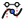

# G9U1 icon-family review candidate

Owned SVGs are the editable source; no Templatev7/upstream pixels were copied.
The existing Locus V2 artwork and its four host-mode mappings are unchanged.
The manifest's existing `icon_ref` is consumed by the Swing action registry;
it does not introduce a second action catalog. Missing/unmapped artwork leaves
the localized action name/help available. Dynamic user tools remain separate.

| Logical asset | Artwork | Shape meaning |
| --- | --- | --- |
| `geocedg.locus-v2-tool-icon` |  | Generator domain and curve |
| `geocedg.spline-v2-tool-icon` |  | Interpolation nodes and smooth curve |
| `geocedg.semantic-point-tool-icon` |  | Point bound to oriented parameter domain |
| `geocedg.rich-result-tool-icon` |  | Evidence card; hollow candidate |
| `geocedg.materialize-tool-icon` |  | Explicit eligible candidate to constructed point |

24-unit vector grids, black outlines and hollow/filled shapes carry meaning
independently of color. The existing Desktop raster/host DPI scaling path remains
authoritative. Product names/help provide accessible text; icon color is never
geometry or availability authority. Canonical-LF SHA-256 and provenance for every
owned tool asset are in `geocedg/resources/assets-manifest.yml`.

Author startup/topbar artwork: no tracked helix/topbar source was found. No
replacement author branding is fabricated; packaging/redistribution restrictions
remain unchanged. This absence does not block functional tool icons.
